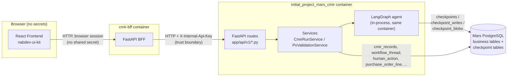
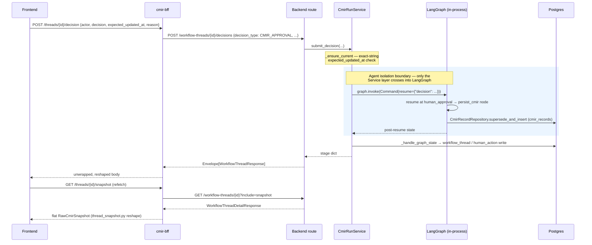
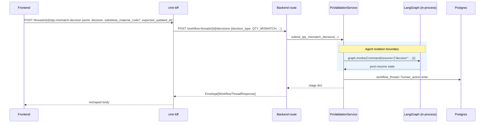

# Architecture — CMIR & PO-Validation Flows

This document covers both HITL (human-in-the-loop) review flows end to end —
CMIR email extraction and PO-line validation — across the three repos that
implement them: the React frontend (`nabdev-ui-kit`), the FastAPI BFF
(`cmir-bff`), and this backend (`initial_project_mars_cmir`). It reflects the
code as of the F1/F2/F3 contract fixes (email in the CMIR snapshot,
`editable_fields` on the CMIR snapshot, and the BFF's snapshot/list reshape
layer) — update this file in the same change if any of the schemas or write
sites it cites move again.

---

## 1. High-Level Design

### 1.1 Components

The `X-Internal-Api-Key` boundary exists **only** on the BFF→Backend hop.
The Frontend→BFF hop carries no shared secret (`cmir-bff/app/core/security.py`'s
`require_browser_session` is a documented no-op today, pending a real
frontend session system). The LangGraph agent is drawn **inside** the
backend container — it is never a separately reachable service, and the BFF
has no path to it other than the HTTP call to the backend's own routes.

**React Frontend** (`nabdev-ui-kit/src/features/cmir-intelligence/`) renders
the review queue and HITL forms, and translates user actions into requests
against the BFF's stable route set. It never talks to the backend directly,
never sees `X-Internal-Api-Key`, and holds no business logic about
`editable_fields`/domain derivation — it consumes what the BFF gives it.

**BFF** (`cmir-bff`) translates and aggregates HTTP contracts between the
frontend's long-standing route shapes and the backend's current ones. It
holds the one shared secret and attaches it to every outbound call
(`app/clients/backend_client.py`). It reshapes the backend's snapshot/list
responses (`app/schemas/snapshots/thread_snapshot.py`, `app/routes/threads.py`)
and translates the three decision endpoints into the backend's collapsed
`decision_type`-discriminated one (`app/schemas/decisions/*.py`). It **never**
imports LangGraph, invokes the graph, touches a checkpoint table, or opens a
direct database connection — every fact it returns comes from an HTTP
response the backend already computed.

**Backend API routes** (`app/api/v1/*.py`) stay thin: parse the request,
call the matching service method, wrap the result in `Envelope[...]`. They
never call `graph.invoke`/`Command(resume=...)` directly, never expose raw
graph state, `__interrupt__`, or checkpoint contents, and never provide a
debug/admin shortcut around the service layer.

**Services** (`app/services/cmir/run_service.py::CmirRunService`,
`app/services/po_validation/service.py::PoValidationService`) are the
**only** callers of `graph.invoke`/`Command(resume=...)` in the whole
system. They own resume-with-answer bookkeeping, optimistic-concurrency
checks (`_ensure_current`), and persisting the post-resume state into
`workflow_thread`/`human_action`.

**LangGraph agent** (`app/agents/cmir/{graph,nodes}.py`,
`app/agents/po_validation/*`) runs in-process inside the backend, paused and
resumed via its own Postgres checkpointer. It is never split into a
separately reachable process, and the BFF has no non-HTTP path to it.

**Mars PostgreSQL** holds both business tables (`cmir_records`,
`purchase_order_lines`, `process.workflow_thread`, `process.human_action`)
and the LangGraph checkpointer's own tables (`checkpoints`,
`checkpoint_writes`, `checkpoint_blobs`) — see §5 for which is which.

### 1.2 One legacy, non-API entry point (not part of this flow)

`scripts/ops/cmir_cli_ingest.py` / `app/services/cli_human_review.py` is a
console-only, interactive-shell tool with no API route and no BFF/frontend
caller. It is out of scope for this document and must not be extended to
close any gap described here.

---

## 2. Low-Level Design

### 2.1 Request/response schemas by route

All backend schemas below live in `app/schemas/cmir/threads.py` unless
noted; PO-validation's in `app/schemas/po_validation/threads.py`.

| Backend route | Request model | Response model |
|---|---|---|
| `GET /api/v1/workflow-threads` | query params: `domain`, `status`, `stage`, `limit`, `cursor` | `Envelope[WorkflowThreadListResponse]` (`items: list[WorkflowThreadResponse]`) |
| `GET /api/v1/workflow-threads/{id}?include=snapshot` | — | `Envelope[WorkflowThreadDetailResponse]` (`WorkflowThreadResponse` fields + `snapshot: CmirThreadSnapshotResponse \| PoValidationThreadSnapshotResponse \| null`, untyped as `dict[str, Any]` on the wire since the two domains' shapes differ) |
| `POST /api/v1/workflow-threads/{id}/missing-fields` | `WorkflowThreadFieldsRequest{actor, fields, expected_updated_at}` | `Envelope[WorkflowThreadResponse]` |
| `PATCH /api/v1/workflow-threads/{id}/draft` | `WorkflowThreadFieldsRequest` | `Envelope[WorkflowThreadDraftResponse]` |
| `POST /api/v1/workflow-threads/{id}/decisions` | `WorkflowThreadDecisionRequest` (discriminated union, §2.4) | `Envelope[WorkflowThreadResponse]` |

`WorkflowThreadResponse`: `id, job_item_id, status, stage, current_node, completed_at, error, metadata_json: dict[str, Any], email_event_id, purchase_order_line_id, updated_at`.

`CmirThreadSnapshotResponse` (extends `WorkflowThreadResponse`): adds
`history: list[SnapshotHistoryItem]` and `editable_fields: list[str]`
(required — always the fixed `CMIR_CONTENT_FIELDS`, see §2.3). It does
**not** add `cmir`/`existing_cmir`/`diff`/`email` — those stay nested in
`metadata_json["latest_snapshot"]` (§2.2), deliberately, since they're
volatile per-stage data rather than a fixed response shape.

`PoValidationThreadSnapshotResponse`: `agent_run_id, thread_id, po_line_id,
po_number, po_line_number, customer_material_code, order_quantity, stage,
candidate: CandidateInfo | None, editable_fields: list[str], history, updated_at`
— already flat; this is the one PO-validation's BFF reshape passes through
unchanged (§4).

**BFF-facing routes** (`cmir-bff`, unchanged frontend URLs) — see §4 for the
full mapping table.

### 2.2 `metadata_json["latest_snapshot"]` — shape by lifecycle state

Written at four sites in `app/services/cmir/run_service.py`, all inside or
called from `_handle_graph_state` except the first:

| Site | Trigger | Keys present |
|---|---|---|
| `update_draft` (~495-499) | `PATCH .../draft` — reviewer edits while still `waiting_approval` | `cmir, existing_cmir, diff, email` (email carried forward unchanged from the prior stored value — this site has no LangGraph `state` in scope, since it's a pure metadata patch, not a graph invocation) |
| `_handle_graph_state`, fresh interrupt (~615-632) | First interrupt of a brand-new run | `cmir, existing_cmir, diff, email` |
| `_handle_graph_state`, resume→another interrupt (~642-653) | e.g. missing-fields submission loops back to another interrupt | `cmir, existing_cmir, diff, email` |
| `_handle_graph_state`, resume→terminal (~700-706) | Approve/reject/conflict — the run completes | **`cmir, email` only** — `existing_cmir`/`diff` are intentionally absent here |

`email` (added by F1) is always a 3-key dict — `{sender, subject,
source_message_id}` — built by `CmirRunService._email_snapshot`, reading
`state.get("email") or {}` defensively. It **never** contains `email_id`:
`state["email"]` (`EmailMessage`, `app/schemas/cmir/domain.py`) has no such
field. The durable id is a sibling graph-state key, `state["email_id"]`,
surfaced on every response as the top-level `email_event_id` — never
duplicated inside `latest_snapshot`.

`batch_id` and `agent_run_id` are **siblings** of `latest_snapshot` inside
`metadata_json`, never nested inside it — set once at thread creation
(`_handle_graph_state`'s fresh-interrupt branch), carried forward
unchanged by every later site via `**metadata`/`**(prior metadata_json)`
spreads.

**Consumers must read every one of `cmir`/`existing_cmir`/`diff`/`email`
independently** (`.get(...)`, never assuming one implies another) — this is
exactly what caused rework before F3: the BFF's reshape
(`cmir-bff/app/schemas/snapshots/thread_snapshot.py`) does this correctly;
do not regress it.

### 2.3 `editable_fields` — two different rules

- **CMIR**: fixed. `CMIR_CONTENT_FIELDS` (`app/schemas/cmir/domain.py:30-49`,
  11 field names) is added by `CmirRunService.get_snapshot` to every CMIR
  snapshot response, regardless of stage. It does not vary per thread.
- **PO-validation**: dynamic. `PoValidationService.get_snapshot`
  (`app/services/po_validation/service.py:301-334`) computes it per
  interrupt type: `qty_mismatch_decision` → `["substitute_material_code"]`,
  `manual_cmir_entry` → `["sap_material_number", "description"]`, otherwise
  `[]`.

Both are flattened onto their respective response models directly (not
nested in `metadata_json`) — for CMIR this doesn't defeat the reason
`cmir`/`existing_cmir`/`diff` stay nested, since unlike those,
`editable_fields` isn't volatile per-stage data.

### 2.4 `decision_type` discrimination

One backend route, `POST /api/v1/workflow-threads/{id}/decisions`, takes a
`WorkflowThreadDecisionRequest` discriminated union
(`app/schemas/cmir/threads.py:132-165`):

| `decision_type` | Request fields | Backend service call |
|---|---|---|
| `CMIR_APPROVAL` | `actor, decision: "approve"\|"reject", expected_updated_at, reason=""` | `CmirRunService.submit_decision` |
| `QTY_MISMATCH` | `actor, decision: "use_substitute"\|"proceed_anyway"\|"mark_stale", substitute_material_code=None, expected_updated_at` | `PoValidationService.submit_qty_mismatch_decision` |
| `MANUAL_CMIR_ENTRY` | `actor, sap_material_number, description="", expected_updated_at` | `PoValidationService.submit_manual_cmir_entry` |

The BFF still exposes 3 separate URLs to the frontend (unchanged contract)
and injects the matching `decision_type` literal itself
(`cmir-bff/app/schemas/decisions/*.py::to_backend_payload`) — the browser
never sends `decision_type`.

### 2.5 `expected_updated_at` / `updated_at` — byte-exact round-trip

`app/schemas/cmir/threads.py:40`'s `IsoDatetime` type
(`Annotated[datetime, PlainSerializer(lambda v: v.isoformat(), return_type=str)]`)
exists solely so a response's `updated_at` serializes exactly as
`datetime.isoformat()` would (`+00:00`, not a `Z` suffix). `_ensure_current`
(`run_service.py:~744-751`) compares the submitted `expected_updated_at`
against `stage["updated_at"].isoformat()` with **exact string equality** —
raising `THREAD_STALE` (409) on any mismatch, including a merely
differently-formatted-but-equivalent timestamp.

**No layer may parse, reformat, or re-serialize this value**: not the BFF
(passed through as an opaque string in every schema in
`app/schemas/decisions/*.py` and `WorkflowThreadFieldsRequest`), not the
frontend (`nabdev-ui-kit/src/models/thread.model.ts`'s doc comment states
this explicitly — `updatedAt` stays a raw string, never a parsed `Date`).

---

## 3. End-to-End Sequence Diagrams

Both diagrams annotate the **agent-isolation boundary**: the Service layer
is the only caller of `graph.invoke`/`Command(resume=...)`.

### 3.1 CMIR — approval / rejection / draft update

Draft update (`PATCH .../draft`) follows the same shape but never touches
the LangGraph state directly — `update_draft` recomputes `merge_with_active`
locally and pushes the result into the checkpoint via `graph.update_state`
(not a resume), then persists `latest_snapshot` itself.

### 3.2 PO-validation — quantity mismatch / manual CMIR entry

Manual CMIR entry follows the identical shape via
`PoValidationService.submit_manual_cmir_entry`, `decision_type:
MANUAL_CMIR_ENTRY`.

---

## 4. API Reference Table

| Frontend calls (unchanged) | BFF route | Backend route | `decision_type` |
|---|---|---|---|
| `GET /runs?view=threads` | `app/routes/threads.py::list_runs` | `GET /workflow-threads?domain=cmir` **+** `?domain=po_validation`, merged (`app/pagination/merge_cursor.py`), then reshaped per item to `RawWorkflowThread` | — |
| `GET /threads/{id}/snapshot` | `app/routes/snapshot.py::get_thread_snapshot` | `GET /workflow-threads/{id}?include=snapshot` | — |
| `POST /threads/{id}/missing-fields` | `app/routes/draft.py::submit_missing_fields` | `POST /workflow-threads/{id}/missing-fields` | — |
| `POST /threads/{id}/update` | `app/routes/draft.py::update_draft` | `PATCH /workflow-threads/{id}/draft` | — |
| `POST /threads/{id}/decision` | `app/routes/decisions.py` | `POST /workflow-threads/{id}/decisions` | `CMIR_APPROVAL` |
| `POST /threads/{id}/qty-mismatch-decision` | `app/routes/decisions.py` | `POST /workflow-threads/{id}/decisions` | `QTY_MISMATCH` |
| `POST /threads/{id}/manual-cmir-entry` | `app/routes/decisions.py` | `POST /workflow-threads/{id}/decisions` | `MANUAL_CMIR_ENTRY` |
| `POST /ingest/po-lines` | `app/routes/po_lines.py` | `POST /po-validation/purchase-order-lines` | — |

---

## 5. Data Flow Notes

**Checkpointer vs. business data.** The LangGraph checkpointer
(`checkpoints`, `checkpoint_writes`, `checkpoint_blobs`) persists a paused
run's full internal state, keyed by `configurable.thread_id` — a
random string minted per run (`CmirRunService._new_checkpoint_thread_id`),
**not** the reviewer-facing `workflow_thread.id` UUID. Resuming
(`Command(resume=answer)`) replays from exactly that checkpoint. **Only the
Service layer** (`CmirRunService`, `PoValidationService`) ever reads or
writes these tables, via LangGraph's own API — never a route, never the BFF,
never a raw query anywhere else.

**Business data** — `cmir_records`, `purchase_order_lines`, and the shared
`process.workflow_thread`/`process.human_action` rows — is the durable,
reviewer-facing record of what happened, independent of whether the
checkpoint that produced it is ever read again. `workflow_thread.metadata_json`
sits in between: it is workflow-internal bookkeeping (the checkpoint thread
id, the agent run id, and `latest_snapshot`, per §2.2) that happens to be
JSON-queryable business-adjacent data, not a first-class column — a
deliberate trade-off from the schema-standardization refactor
(`app/repositories/process/workflow.py`'s module docstring), not an
oversight.

---

## 6. Known Gaps (stated, not hidden)

- **`SnapshotHistoryItem` vs. the frontend's `transformHistoryEntry`.** The
  shared history schema (`actor, action_type, decision, response_payload,
  responded_at`) doesn't match what the frontend reads (`field_changes`,
  `created_at`). This degrades gracefully today (an empty `fieldChanges: {}`
  per entry, no crash) but loses field-level history detail in the UI. Not
  fixed as part of F1/F2/F3 — flagged for a future pass.
- **Pre-F1 threads have no stored email.** Any `workflow_thread` row created
  before this change has no `email` key in its stored `latest_snapshot`; its
  detail panel will permanently show `null` sender/subject/source_message_id
  (the durable `email_id`, from `email_event_id`, is unaffected). No
  backfill migration was run for this — accepted, per explicit decision, as
  a one-time gap for pre-existing data only.
- **`view="agents"|"batches"` and the `sender` list filter are permanently
  gone**, not pending — the old `batch_id`-grouping concept and a
  queryable sender/customer field were both removed by the schema-standardization
  refactor. The BFF surfaces both as explicit `422`s (`VIEW_NOT_SUPPORTED`,
  `SENDER_FILTER_NOT_SUPPORTED`) rather than silently ignoring them.
- **`AgentRun.workflow_thread_id` stays `NULL`** for every CMIR/PO run that
  reaches a thread — the FK is never backfilled; the link only exists via
  `metadata_json["agent_run_id"]`/`metadata_json["checkpoint_thread_id"]`.

## 7a. Ontology layer (CMIR ↔ Material Master traceability) — out of scope here

A separate, additive read-side capability exists alongside the flows this
document covers: an in-process `rdflib` graph, rebuilt on an interval from
`cmir.cmir_record`/`common.material`/`common.material_master`, queried via
SPARQL for two lookups — "which CMIR records reference this material" and
"what replaced this discontinued material." It shares this backend's
process and Postgres instance but touches none of the HITL flows,
checkpointer, or schemas described above; it does not read or write
`workflow_thread`/`human_action`, is not invoked by
`CmirRunService`/`PoValidationService`, and has no reasoning/inference
component (that's a separate, deferred piece of work). Full write-up,
including why it runs in-process rather than as an Azure Functions timer
trigger: **`docs/ontology.md`**.

## 7. Scope decisions made during F1/F2/F3 (beyond the original request)

Two implementation choices went beyond the original F1/F2/F3 ask, each
confirmed explicitly during that work's own session (not merely assumed):

- **`update_draft`'s email carry-forward** (§2.2 table, first row) — this
  site has no LangGraph `state` in scope (it's a metadata patch, not a graph
  invocation), so it can't read `state["email"]` the way the other three
  sites do. Confirmed: carry the previously-stored `email` value forward
  unchanged, since a draft edit never touches email data.
- **The `GET /runs` thread-list reshape** (`cmir-bff/app/routes/threads.py`)
  — not part of the original F1/F2/F3 scope, added after discovering the
  list route had the identical un-reshaped-passthrough problem as the
  snapshot route: without it, every row's `thread_id` came back `undefined`
  on the frontend, so a reviewer could never open a thread to reach the
  (now-correct) snapshot at all.
