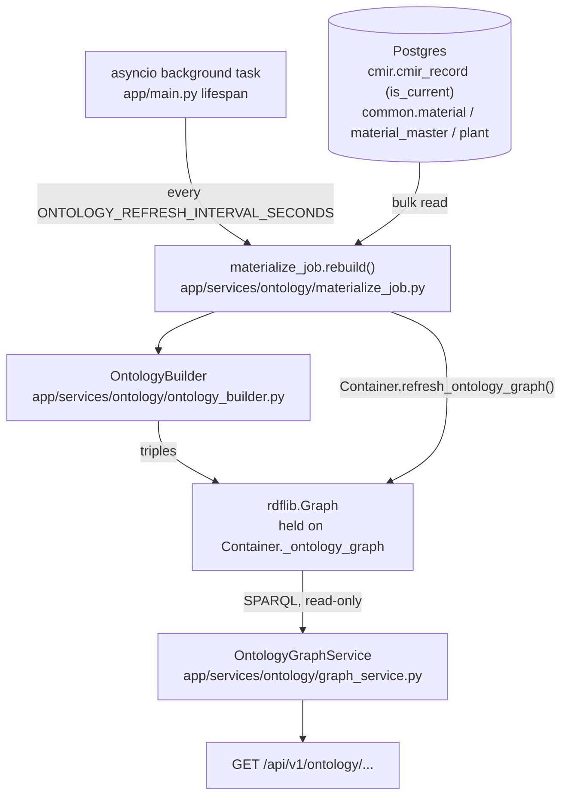

# Ontology Layer — CMIR ↔ Material Master Traceability

End-to-end reference for the semantic-graph traceability layer between
`cmir.cmir_record` and `common.material`/`common.material_master`. This is
**component B only** of the originally-scoped two-part ontology plan —
reasoning/inference over the same vocabulary (matching/conflict
classification via a DL reasoner) is a separate, deferred piece of work and
is **not** implemented here. Nothing in this document depends on it.

If you're new to this part of the codebase, read this top to bottom once;
after that, use it as a reference (§7 API, §8 config, §9 file map).

---

## 1. Problem this solves

`cmir.cmir_record` resolves a customer's email-stated material reference to
an internal material/GRD code. `common.material`/`common.material_master`
hold the SAP-sourced catalog, plant by plant, with discontinuation and
successor chains via `follow_up_material_id`. The relational link between
the two is real (foreign keys, string matching in the repositories) but
answering questions that cross both — "which CMIR records reference this
material" or "what replaced this discontinued material, and what replaced
that" — meant hand-written joins repeated ad hoc, with no clean way to
express a multi-hop successor chain in one query.

This layer builds a small, purpose-built read model instead: a `rdflib`
RDF graph, rebuilt periodically from Postgres, queried with SPARQL. Two
lookups exist today:

- **Traceability** — every current CMIR record that resolves to a given
  material.
- **Successor chain** — the full replacement chain starting from a
  discontinued `MaterialMaster` row.

No table joins for either at request time; both are graph queries against
an in-memory snapshot.

## 2. What this is *not*

- **Not a reasoner.** There is no OWL DL reasoning, no `owlready2`, no JVM
  dependency, no inferred "matched"/"conflict" classification, and no
  `ontology.inferred_match` table. The vocabulary (§4) is descriptive only
  — classes and properties, no restrictions or axioms a reasoner would
  interpret.
- **Not a new database schema.** The graph is in-memory only, rebuilt on an
  interval. Nothing is persisted beyond the existing `cmir`/`common` tables
  it reads from.
- **Not wired into PO validation or CMIR merge decisions.** Nothing here
  changes any existing write path or blocks/flags a live decision. It is a
  pure, additive read side.

## 3. Architecture



**Everything runs in one process** — the same FastAPI app serving the rest
of the backend. There is no separate deployable, no Azure Function, no
external scheduler.

### 3.1 Why in-process, not an Azure Functions timer trigger

This repo's only existing periodic-work pattern is an Azure Functions timer
trigger (`azure_functions/enqueue_new_mail.py`). That was considered and
rejected for this job: a Function invocation is a **separate process** from
the FastAPI app that serves the traceability API, so a graph built there
would not be visible to the API process without an extra cross-process
handoff (e.g. serializing the graph to Blob Storage and reloading it). For
a first version, running the rebuild as an `asyncio` background task
inside the API process itself is simpler, has no cross-process handoff,
and ties the rebuild's cadence directly to the process that actually serves
the read side.

The trade-off, accepted for v1: rebuild cadence is tied to this one
process's own uptime, and if the API runs as multiple replicas, each
replica rebuilds and holds its own independent copy of the graph (no
shared state, no cross-replica consistency guarantee beyond "eventually
all replicas converge" on their own schedule).

### 3.2 Lifecycle

Started and stopped by `app/main.py`'s `lifespan`:

1. On app startup, an `asyncio.create_task` begins looping
   `_run_ontology_materialize_loop`.
2. The loop calls `Container.build()` and `materialize_job.rebuild(container)`
   immediately — so the graph is populated shortly after startup, not left
   empty until the first interval elapses.
3. `rebuild()` runs on a worker thread (`asyncio.to_thread`) since it does
   blocking DB I/O and in-memory graph construction — it never blocks the
   event loop the API is also using to serve requests.
4. Any exception (including a missing/unreachable Postgres) is caught and
   logged; the loop retries on the next interval rather than crashing app
   startup. This matters for tests that inject fake `CmirRunService`/
   `PoValidationService` specifically to avoid ever needing a real
   Postgres-backed `Container` — `Container.build()` is only ever attempted
   from inside this loop's own try/except, never synchronously during
   `lifespan` startup.
5. On shutdown, the task is cancelled and awaited before the rest of
   `lifespan`'s cleanup runs.

### 3.3 Cold start

Right after process startup, before the first `rebuild()` completes,
`Container.get_ontology_graph()` returns `None`. The dependency that builds
`OntologyGraphService` (`get_ontology_graph_service` in
`app/api/dependencies.py`) treats that as an empty graph rather than an
error — API calls in that (typically sub-second) window return correct-shape,
empty results (`cmir_records: []`, `chain: []`), never a 500.

## 4. Vocabulary

`app/ontology/schema/mars_ontology.ttl` — the shared Turtle vocabulary,
git-versioned, hand-edited (Protégé is a fine visual aid for this but is a
design-time tool only, never a runtime dependency).

| Kind | Terms |
|---|---|
| Classes | `CmirRecord`, `Material`, `MaterialMaster`, `Plant` |
| Object properties | `referencesMaterial` (CmirRecord → Material), `hasPlantRecord` (Material → MaterialMaster), `locatedAtPlant` (MaterialMaster → Plant), `succeededBy` (MaterialMaster → Material) |
| Data properties | `brand`, `site`, `customerIdentity`, `targetCustomerMaterialRef` (all on CmirRecord); `sapMaterialNumber`, `discontinuationIndicator` (on MaterialMaster); `materialCode` (on Material); `plantCode` (on Plant) |

Two data properties (`customerIdentity`, `targetCustomerMaterialRef`) were
added beyond the vocabulary's original 4-property sketch during
implementation — the traceability endpoint's response needs to display
them, and there was no other way to carry that data into the graph.

**`succeededBy` is not transitive as an OWL axiom.** It points from a
discontinued `MaterialMaster` row to the `Material` that replaces it — not
to another `MaterialMaster` directly, matching the real
`follow_up_material_id` column's semantics (a `MaterialMaster` FK to
`common.material.id`, not to another `material_master` row). Walking a
multi-hop chain therefore composes two properties per hop —
`succeededBy` then `hasPlantRecord` (Material → its own MaterialMaster row)
— as a single SPARQL 1.1 property path,
`(mars:succeededBy/mars:hasPlantRecord)`, evaluated one hop at a time by
`OntologyGraphService.successor_chain` (not via an OWL
`owl:TransitiveProperty` declaration, since there is no reasoner to
interpret one).

### 4.1 IRI scheme

IRIs are derived deterministically from each row's natural key where one
exists, so the same underlying row always maps to the same node across
every rebuild:

| Entity | IRI pattern | Key used |
|---|---|---|
| Material | `.../material/{material_code}` | natural key (`material_code`, unique) |
| Plant | `.../plant/{plant_code}` | natural key (`plant_code`, unique) |
| MaterialMaster | `.../material-master/{id}` | primary key (no single natural key — one row per (material, plant)) |
| CmirRecord | `.../cmir-record/{id}` | primary key (no natural key on the row itself) |

Base namespace: `https://ontology.mars-cmir.nablon.ai/` — an identifier
namespace only, not a resolvable URL; nothing is ever fetched from it.

## 5. Sync strategy — full rebuild, not incremental patching

Every interval, `materialize_job.rebuild()` does one **full** rebuild, not
an incremental patch of the existing graph:

1. Bulk-read every current (`is_current = true`) `cmir_record` row, plus
   every `material`/`material_master`/`plant` row.
2. Build a brand-new `rdflib.Graph` from scratch via
   `OntologyBuilder.build_rdf_triples`.
3. Swap it into `Container` via `refresh_ontology_graph()` (lock-guarded —
   a concurrent reader always sees either the complete previous graph or
   the complete new one, never a half-built one).

This is deliberately simple over deliberately efficient: a full rebuild is
self-healing (a bug in one cycle can't accumulate drift the way a missed
incremental-patch event could) and needs no dependency tracking between
Postgres writes and graph updates. It is the right trade-off at the data
volumes this table set is expected to hold; if that stops being true, the
next step would be incremental upserts keyed on the same IRIs described in
§4.1, not a redesign of the vocabulary.

## 6. Read side — `OntologyGraphService`

`app/services/ontology/graph_service.py`. Two methods, both pure SPARQL
reads against whatever graph `Container.get_ontology_graph()` currently
holds — never a reasoner invocation, never a database round-trip.

```python
find_cmir_records_for_material(material_code: str) -> TraceabilityResult
successor_chain(material_master_id: UUID) -> SuccessorChainResult
```

`successor_chain` walks one hop at a time in a bounded Python loop (max 50
hops), each hop resolved by one SPARQL query using the composed property
path from §4 — this is what lets the traversal detect and stop on a cyclic
graph (a malformed `follow_up_material_id` data fix pointing back at an
earlier material) instead of looping forever, which a single unbounded
`path*` query wouldn't let it do cleanly.

## 7. API

Both routes sit under the existing `X-Internal-Api-Key`-protected router
(`protected_router` in `app/api/router.py`), same as every other backend
route.

| Route | Returns |
|---|---|
| `GET /api/v1/ontology/materials/{material_code}/traceability` | `Envelope[TraceabilityResult]` — every current CMIR record resolving to this material |
| `GET /api/v1/ontology/material-masters/{material_master_id}/successor-chain` | `Envelope[SuccessorChainResult]` — the ordered replacement chain starting from this MaterialMaster |

Example (from a live run against seeded dev data):

```json
GET /api/v1/ontology/materials/SMOKE2-GRD-OLD/traceability

{
  "success": true,
  "message": "OK",
  "data": {
    "material_code": "SMOKE2-GRD-OLD",
    "cmir_records": [
      {
        "cmir_record_id": "01a0ada1-82ff-7434-97ca-30144c015d52",
        "customer_identity": "Smoke Test Customer 2",
        "target_customer_material_ref": "SMOKE2-REF",
        "brand": "SmokeBrand",
        "site": "SmokeSite"
      }
    ]
  },
  "error": null
}
```

`OntologyGraphService` is built fresh per request by
`get_ontology_graph_service` (`app/api/dependencies.py`) — deliberately
**not** memoized on `app.state` the way `get_service`/`get_po_service` are,
since the underlying graph object changes out from under `Container` every
refresh interval; a memoized service would risk serving a stale graph
reference indefinitely.

## 8. Configuration

| Setting | Env var | Default | Where |
|---|---|---|---|
| Rebuild interval | `ONTOLOGY_REFRESH_INTERVAL_SECONDS` | `300` (5 minutes) | `app/core/config/ontology.py::OntologySettings` |

No other configuration exists today — no toggle to disable the background
task, no separate staging/prod cadence. If the interval needs to differ by
environment, set the env var per environment; the default is a starting
point, not a validated production value (see §10).

## 9. File map

```
app/ontology/schema/mars_ontology.ttl        # shared vocabulary (§4)

app/services/ontology/ontology_builder.py    # row -> RDF triple mapping (shared by builder & job)
app/services/ontology/materialize_job.py      # rebuild(): bulk read + build + Container swap
app/services/ontology/graph_service.py        # OntologyGraphService: the two SPARQL queries

app/schemas/ontology/traceability.py          # TraceabilityResult / SuccessorChainResult DTOs
app/api/v1/ontology.py                        # the two GET routes
app/api/dependencies.py                       # get_ontology_graph_service (not memoized, see §7)

app/core/config/ontology.py                   # OntologySettings.refresh_interval_seconds
app/core/container.py                         # _ontology_graph field, refresh_ontology_graph(), ontology_repos()
app/main.py                                   # lifespan: starts/cancels the background rebuild loop

app/repositories/cmir/cmir_record.py          # + list_current() (raw ORM rows, for the builder)
app/repositories/common/master_data.py        # + list_material_rows()/list_material_master_rows()/list_plant_rows()

tests/unit/services/test_ontology_builder.py       # row -> triple mapping, no DB, no reasoner
tests/unit/services/test_ontology_graph_service.py # SPARQL queries incl. multi-hop chain + cycle guard
tests/unit/api/test_api_ontology.py                # router tests via dependency_overrides
tests/integration/test_ontology_materialize_job.py # rebuild() against real Postgres
```

`Container`'s docstring (`app/core/container.py`) documents
`_ontology_graph` as the one deliberate exception to "repositories are
fresh per call" — read it there for the full reasoning, not duplicated
here.

## 10. Status / known gaps

- **Validated against dev Postgres, not staging.** Every test above runs
  against a real (dev) Postgres instance and passes; an end-to-end smoke
  check (seed real rows, run the app with `lifespan` active, hit both
  routes) was also run manually and confirmed correct output, including a
  genuine multi-hop successor chain. A staging environment was not
  reachable from this work session — before relying on this in a shared
  environment, repeat that spot-check there with real (not synthetic) CMIR/
  material pairs.
- **Refresh interval is a default, not a validated value.** 300 seconds is
  a reasonable starting point, not a number derived from this table set's
  actual write volume or staleness tolerance. Revisit once real usage
  patterns are known.
- **Reasoning/inference (component A) is not built.** No `owlready2`, no
  match/conflict classification, no `ontology.inferred_match` table, no
  hook into `PoValidationNodes`. If and when that work starts, it shares
  this same vocabulary (§4) but is a separate runtime component — see the
  original two-component plan for the design (a DL reasoner over a
  separate `owlready2` World, not this `rdflib` graph, kept deliberately
  apart so reasoning cycles never block or corrupt traceability reads).
- **No admin/manual "trigger a rebuild now" endpoint.** The only way to
  force a fresh graph today is to wait for the next interval or restart the
  process. Add one if operational experience shows the interval is too
  coarse for debugging a specific data fix.
