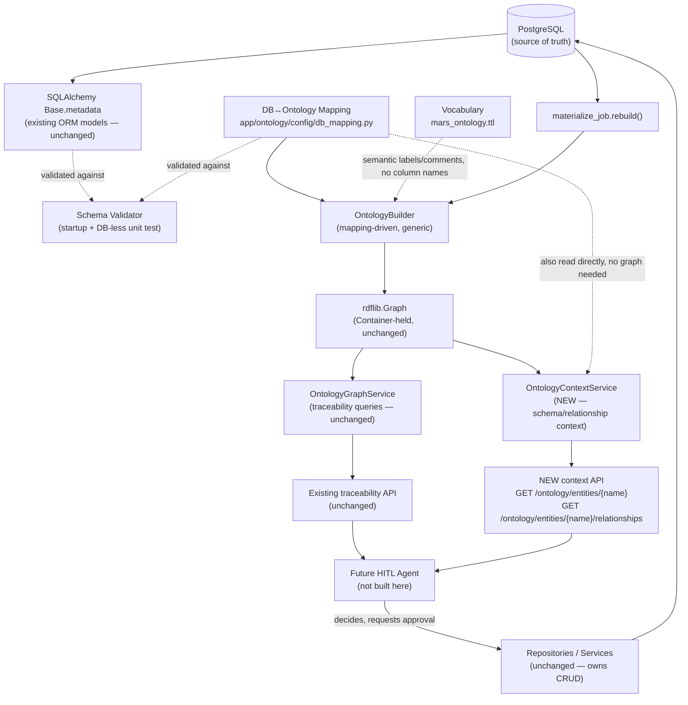
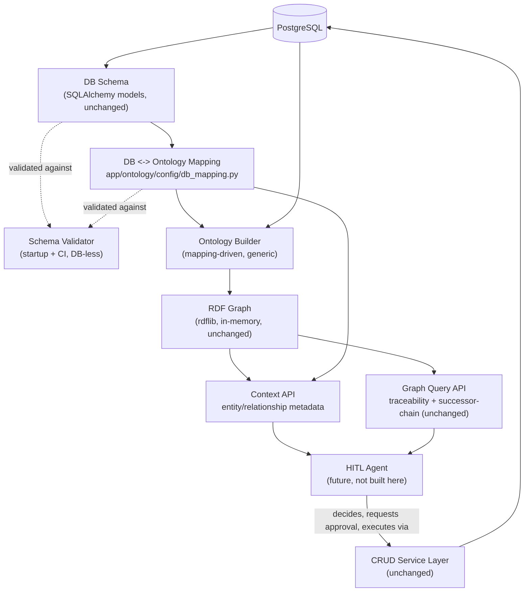

# Ontology as a Semantic Context Layer — Next-Phase Design

**Status:** Proposal — not implemented. No production code, migrations, vocabulary, or API changes accompany this document.
**Audience:** Engineering review, then manager/team sign-off, then (once approved) an implementation task.
**Scope:** Re-orients the ontology layer's *next phase* from "traceability lookups" toward "a semantic context layer a future HITL Agent can query to understand entities, relationships, and schema before proposing a CRUD operation" — and designs a schema-evolution strategy so a DB change touches the minimum number of files.

---

## 1. Executive Summary

The ontology layer that exists today (`app/services/ontology/`) answers two questions — "which CMIR records reference this material" and "what replaced this discontinued material" — via a small `rdflib` graph rebuilt from Postgres on an interval. It works, is tested, and is documented in `docs/ontology.md`. But its DB-to-ontology mapping is **hardcoded directly in Python** (`OntologyBuilder`'s method bodies read ORM attributes by name and call `graph.add(...)` inline). That's fine for two fixed queries over four classes; it does not scale to the new ask — a general-purpose schema/relationship *context* layer, consumed by a future agent, that must survive routine schema evolution (column renames, new tables, FK changes) without a shotgun edit across the builder, the graph service, the API, and every test.

**Recommendation, in one paragraph:** keep `rdflib` and Turtle (no graph database, no OWL reasoner — nothing in this repo justifies either). Introduce one new artifact, a **DB↔ontology mapping configuration** (§10, §12) — Python dataclasses, not YAML — that becomes the single source of truth for "which table.column backs which semantic property/relationship." `OntologyBuilder` is refactored to *read* that config generically instead of hand-coding each property; a small **schema validator** (§13) checks the config against SQLAlchemy's own `Base.metadata` at app startup and in a fast, DB-less unit test, so a stale mapping fails loudly instead of silently producing an incomplete graph. On top of the existing graph, add a **context API** (§16) — `get_entity_context`, `get_relationships`, `traverse_relationship` — that answers schema/relationship questions without executing any CRUD operation; CRUD stays exactly where it is today (`app/repositories/*`, `app/services/*`), called by a future HITL Agent that is *informed* by ontology context but never delegates execution to it.

This is six incremental phases (§18), each shipping a working, tested system, starting from extracting today's hardcoded mapping into the new config (no behavior change) and ending with the context API and a written HITL integration contract. Nothing here requires abandoning the traceability feature already shipped — it becomes the first consumer of the new mapping-driven builder.

---

## 2. Current State

Built and shipped this engagement, entirely additive to the rest of the backend:

- **Vocabulary**: `app/ontology/schema/mars_ontology.ttl` — 4 `owl:Class`es, 4 `owl:ObjectProperty`s, 8 `owl:DatatypeProperty`s. Descriptive only; explicitly documented in the file's own header comment as "not meant to be interpreted by a DL reasoner."
- **Builder**: `app/services/ontology/ontology_builder.py::OntologyBuilder` — one Python class, ~140 lines, that takes lists of SQLAlchemy ORM rows and emits RDF triples.
- **Materialize job**: `app/services/ontology/materialize_job.py::rebuild(container)` — bulk read, build, swap.
- **Graph service**: `app/services/ontology/graph_service.py::OntologyGraphService` — two SPARQL-backed methods.
- **API**: `app/api/v1/ontology.py` — two `GET` routes.
- **Container wiring**: `app/core/container.py` — `_ontology_graph` field (process-lifetime, the one deliberate exception to "repos are per-call"), `refresh_ontology_graph`/`get_ontology_graph`, `ontology_repos()`.
- **Lifecycle**: `app/main.py`'s `lifespan` — an `asyncio` background task, immediate first rebuild, `ONTOLOGY_REFRESH_INTERVAL_SECONDS` (default 300s, `app/core/config/ontology.py::OntologySettings`).
- **Tests**: 17 ontology-specific tests (5 builder, 5 graph-service, 5 API, 2 Postgres integration), all passing; 629/629 full unit suite unaffected.
- **Matching fix applied this session**: `referencesMaterial` now matches `cmir.cmir_record.material_identity` → `common.material.material_code` (was `target_grd_code`, corrected — see `docs/ontology.md` and this repo's own git history for that change; not revisited here).

**What does not exist today**: any config file, schema-introspection step, or generic mapping mechanism. Every fact the builder emits is a literal Python statement referencing a specific ORM attribute.

---

## 3. Current Architecture

### 3.1 Data flow

```
PostgreSQL (cmir.cmir_record, common.material/material_master/plant)
    │  bulk read — CmirRecordRepository.list_current(),
    │  MasterDataRepository.list_material_rows()/list_material_master_rows()/list_plant_rows()
    ▼
materialize_job.rebuild(container)              [app/services/ontology/materialize_job.py]
    │  constructs a fresh rdflib.Graph, calls OntologyBuilder.build_rdf_triples(...)
    ▼
OntologyBuilder.build_rdf_triples(...)            [app/services/ontology/ontology_builder.py]
    │  RDF.type / MARS.* triples, one _add_* method per entity kind
    ▼
rdflib.Graph  (in-memory)
    │  Container.refresh_ontology_graph(graph)   [app/core/container.py]
    ▼
Container._ontology_graph  (process-lifetime, lock-guarded)
    │  Container.get_ontology_graph()
    ▼
OntologyGraphService(graph=...)                   [app/services/ontology/graph_service.py]
    │  built fresh per request — get_ontology_graph_service() [app/api/dependencies.py]
    ▼
GET /api/v1/ontology/materials/{code}/traceability
GET /api/v1/ontology/material-masters/{id}/successor-chain   [app/api/v1/ontology.py]
```

### 3.2 File/class map (exact)

| Step | File | Class/function |
|---|---|---|
| Bulk read (CMIR) | `app/repositories/cmir/cmir_record.py` | `CmirRecordRepository.list_current()` |
| Bulk read (materials/plants) | `app/repositories/common/master_data.py` | `MasterDataRepository.list_material_rows()`, `list_material_master_rows()`, `list_plant_rows()` |
| Rebuild orchestration | `app/services/ontology/materialize_job.py` | `rebuild(container)` |
| Row → triple mapping | `app/services/ontology/ontology_builder.py` | `OntologyBuilder.build_rdf_triples`, `._add_material`, `._add_plant`, `._add_material_master`, `._add_cmir_record` |
| IRI construction | `app/services/ontology/ontology_builder.py` | `OntologyBuilder.material_iri`, `.plant_iri`, `.material_master_iri`, `.cmir_record_iri` |
| Graph storage | `app/core/container.py` | `Container._ontology_graph`, `.refresh_ontology_graph`, `.get_ontology_graph`, `._ontology_graph_lock` |
| Background scheduling | `app/main.py` | `_run_ontology_materialize_loop`, wired in `create_app`'s `lifespan` |
| Query execution | `app/services/ontology/graph_service.py` | `OntologyGraphService.find_cmir_records_for_material`, `.successor_chain`, `._chain_link_for_master` |
| API surface | `app/api/v1/ontology.py` | `get_material_traceability`, `get_successor_chain` |
| DI | `app/api/dependencies.py` | `get_ontology_graph_service` |
| Config | `app/core/config/ontology.py` | `OntologySettings.refresh_interval_seconds` |

### 3.3 Where schema/table/column knowledge is hardcoded

Every one of these is a literal attribute name inside `OntologyBuilder`, `app/services/ontology/ontology_builder.py`:

- `material.material_code`, `material.id` (`_add_material`)
- `plant.plant_code`, `plant.id` (`_add_plant`)
- `material_master.sap_material_number`, `.discontinuation_indicator`, `.material_id`, `.plant_id`, `.follow_up_material_id`, `.id` (`_add_material_master`)
- `cmir_record.brand`, `.site`, `.customer_identity`, `.target_customer_material_ref`, `.material_identity`, `.id` (`_add_cmir_record`)

There is **no separate description of the schema anywhere else** — the ORM models (`app/models/cmir/cmir_record.py`, `app/models/common/material.py`, `app/models/common/plant.py`) are the only other place these names appear, and they're the *source*, not a second copy.

### 3.4 Where relationships are hardcoded

Also entirely inside `OntologyBuilder`:

- `referencesMaterial`: `_add_cmir_record` — `if cmir_record.material_identity in known_material_codes: graph.add((iri, MARS.referencesMaterial, self.material_iri(cmir_record.material_identity)))`
- `hasPlantRecord`: `_add_material_master` — `graph.add((self.material_iri(material_code), MARS.hasPlantRecord, iri))`
- `locatedAtPlant`: `_add_material_master` — conditional on `material_master.plant_id`
- `succeededBy`: `_add_material_master` — conditional on `material_master.follow_up_material_id`

Each relationship is a bespoke `if`-guarded `graph.add(...)` call. Adding a fifth relationship means writing a fifth bespoke block, by hand, in this file.

### 3.5 Where RDF/OWL/Turtle definitions live

`app/ontology/schema/mars_ontology.ttl` only. Loaded nowhere at runtime today — `OntologyBuilder` does **not** parse this file; it constructs the `MARS` namespace directly in Python (`app/services/ontology/ontology_builder.py:25`, `MARS = Namespace("https://ontology.mars-cmir.nablon.ai/")`) and references properties as Python attribute access (`MARS.referencesMaterial`). **This is a real, pre-existing gap worth naming plainly**: the `.ttl` file and the Python code that emits triples using that same vocabulary are two independent, hand-synchronized things today. Nothing currently checks they agree (see §13's proposed validation, which should close exactly this gap).

### 3.6 How graph refresh/rebuild works

`app/main.py`'s `lifespan` starts one `asyncio.create_task` per app process, looping `materialize_job.rebuild()` on an interval, `Container.build()` called from inside the loop's own `try/except` (deliberately, to avoid breaking `tests/unit/api/test_main_lifespan.py`'s fake-service injection — see that file and `app/main.py`'s own comments). Each cycle is a **full rebuild**, not an incremental patch — a fresh `rdflib.Graph()` every time, swapped in atomically under `Container._ontology_graph_lock`.

### 3.7 How APIs consume the graph

`get_ontology_graph_service()` (`app/api/dependencies.py`) builds a fresh `OntologyGraphService` per request from whatever `Container.get_ontology_graph()` currently returns (or an empty `Graph()` if no rebuild has completed yet). Deliberately not memoized on `app.state` — the underlying graph object is replaced out-of-band by the background task, so memoizing the *service* would risk holding a stale graph reference forever.

### 3.8 How tests validate the implementation

- `tests/unit/services/test_ontology_builder.py` — constructs ORM objects in memory (no DB), calls `build_rdf_triples`, asserts exact triples via `(s, p, o) in graph`.
- `tests/unit/services/test_ontology_graph_service.py` — same in-memory graph construction, asserts SPARQL query results including a genuine multi-hop chain and a cycle guard.
- `tests/unit/api/test_api_ontology.py` — FastAPI `TestClient` + `dependency_overrides[get_ontology_graph_service]`.
- `tests/integration/test_ontology_materialize_job.py` — real Postgres, seeds rows via the repositories, runs `rebuild()`, asserts graph shape.

None of these tests reference `mars_ontology.ttl` at all (consistent with §3.5's finding — the file isn't loaded, so nothing currently tests it stays consistent with the Python-side vocabulary).

---

## 4. Current Code/File Map

(Consolidated view of §3.2 for quick reference — same files, grouped by concern.)

```
app/ontology/schema/mars_ontology.ttl          # vocabulary (not loaded at runtime today — see §3.5)

app/services/ontology/ontology_builder.py      # ALL DB↔ontology mapping knowledge lives here, hardcoded
app/services/ontology/materialize_job.py       # orchestration
app/services/ontology/graph_service.py         # queries

app/schemas/ontology/traceability.py           # API response DTOs
app/api/v1/ontology.py                         # routes
app/api/dependencies.py                        # get_ontology_graph_service

app/core/config/ontology.py                    # refresh interval setting
app/core/container.py                          # graph storage/lifecycle
app/main.py                                    # background task

app/repositories/cmir/cmir_record.py           # list_current() (added for ontology's bulk read)
app/repositories/common/master_data.py         # list_material_rows()/list_material_master_rows()/list_plant_rows()

tests/unit/services/test_ontology_builder.py
tests/unit/services/test_ontology_graph_service.py
tests/unit/api/test_api_ontology.py
tests/integration/test_ontology_materialize_job.py

docs/ontology.md                               # end-to-end reference for the shipped feature
```

---

## 5. New Requirement Understanding

Restated precisely, to anchor the rest of this document against something checkable:

1. Ontology's job shifts from "answer two specific traceability questions" to "describe the schema and relationships generically enough that a not-yet-built HITL Agent can look up any entity and learn: what table backs it, what properties/columns it has, what it's related to, and how to traverse to a related entity."
2. Ontology must **not** execute CRUD. It informs; something else (existing repositories/services, called by the agent) executes.
3. The **primary design pressure** is schema evolution: a column rename, table rename, new table, dropped column, or relationship change should require editing as few files as possible — ideally one mapping artifact, not the builder's Python logic scattered across several `_add_*` methods, not the API, not every test.
4. The user explicitly asked me to *evaluate*, not assume, whether a config-driven mapping layer is the right answer, and to compare it against alternatives (hardcoded Python, DB introspection, a hybrid). §11 does this comparison; §10/§12 give the recommendation and its shape.

**ASSUMPTION**: "HITL Agent" here refers to a future component in the same family as the existing `CmirRunService`/`PoValidationService` human-in-the-loop flows documented in `docs/ARCHITECTURE.md` — i.e., an agent that pauses for human approval before a write, not a fully autonomous one. Nothing in this repo today names or scaffolds such an agent for ontology specifically; this document treats it as a *future consumer* whose interface we're designing toward (§16), not a component we're building.

---

## 6. Target Architecture



### 6.1 Layer responsibilities

| Layer | Should | Should NOT |
|---|---|---|
| **1. Database** | Remain the single system of record for all business data. | Store ontology-specific state; be duplicated. |
| **2. DB↔ontology mapping** | Declare, for each semantic entity/property/relationship, exactly which table/column backs it. Be the *only* place a column name appears outside the ORM models themselves. | Contain behavior/control flow; know about HTTP, SPARQL, or the agent. |
| **3. Ontology vocabulary** | Declare classes/properties and their *business* meaning (labels, comments). | Contain a physical table or column name anywhere. |
| **4. Ontology builder/materializer** | Read the mapping generically (loop over declared entities/relationships) and emit triples. Contain the handful of genuinely-behavioral pieces (multi-hop traversal, cycle guards) that aren't reducible to a mapping fact. | Hardcode a specific column name inline (that's what the mapping is for). |
| **5. RDF graph** | Hold the current in-memory materialized snapshot. | Become a second persisted system of record; be queried transactionally. |
| **6. Graph query/service layer** | Answer read-only questions via SPARQL (traceability, and now schema/relationship context) against the current graph. | Execute writes; call a repository. |
| **7. Context/query API** | Expose entity/relationship/schema context over HTTP, `Envelope`-wrapped like every other route. | Expose a CRUD endpoint under this router. |
| **8. HITL Agent** (future) | Consume context to decide *what* operation makes sense and *what* related entities to consider; request human approval per existing HITL patterns. | Ask ontology to perform the write; bypass the repository/service layer. |
| **9. CRUD/repository/service layer** | Remain exactly as it is today — the only thing that writes to Postgres. | Depend on ontology to function (ontology must be able to be down/stale without breaking a write path). |

---

## 7. Ontology Responsibilities (concise restatement of §6.1, rows 2–7)

Ontology, end to end, should be able to answer:
- "What is entity X, and what real table/columns back it?"
- "What are X's properties, and what do they mean?"
- "What is X related to, and what does that relationship mean?"
- "How do I get from X to a related entity Y?"

Ontology should never:
- Execute an `INSERT`/`UPDATE`/`DELETE`.
- Be the durable record of anything — a rebuild must be able to reconstruct the entire graph from Postgres alone, at any time, with zero information loss (this is already true today and must remain true).
- Decide business policy (e.g., "is this CMIR record allowed to reference this material") — that's validation/business logic, which belongs to the CRUD layer or the future agent, not the context layer.

---

## 8. DB Schema Context Model

What should the context layer expose about an entity? The user's list is broad (PK, columns, datatypes, nullability, FKs, business meaning, "potentially CRUD capability metadata"). Recommendation: **expose less than everything, by design.**

| Field | Include? | Why |
|---|---|---|
| Entity name + source table (`common.material_master`) | **Yes** | The single most important fact — "what real thing is this," needed for every downstream question. |
| Business description (from the `.ttl` `rdfs:comment`) | **Yes** | This is exactly what a reasoning agent (LLM-backed or not) needs and a raw DB schema cannot provide — it's *why* a column exists, not just its type. |
| Primary key column name | **Yes** | Needed to know what identifies an instance for traversal/lookup. |
| Properties actually modeled in the ontology (a *subset* of real columns) | **Yes, but curated** | Only the properties the vocabulary actually declares (§3.5's 8 datatype properties) — e.g. `MaterialMaster.available_quantity`, `.uom`, `.effective_out_date`, `.source_system`, `.last_synced_at` exist on the real table (`app/models/common/material.py`) but are **not** in the vocabulary today, deliberately (they weren't needed for traceability). Exposing every DB column regardless of ontology relevance turns this into a generic schema-dump tool, which is a different (and already-solved, via `information_schema`/`\d`) problem — not what an agent needs to reason about *business* relationships. |
| Datatype | **Yes, but simplified** | `string`/`uuid`/`date`/`decimal`/`boolean` — enough for an agent to know how to format a value, not full SQLAlchemy type introspection detail. |
| Nullable | **Yes** | Directly useful: "is this field required before I can consider the entity complete." |
| Foreign keys, framed as **semantic relationships**, not raw FK names | **Yes — this is the whole point, see §9** | An agent should see `succeededBy → Material`, never `follow_up_material_id`. |
| CRUD capability metadata | **Not yet — flagged as an OPEN QUESTION, §21** | Tempting (e.g. "this entity is read-only from ontology's perspective, writes go through `MasterDataRepository.add_material_master`"), but nothing in the current codebase has a canonical place this lives (no per-entity "which service owns writes" registry exists). Building this now would mean inventing a second registry alongside the mapping config, for a feature the HITL Agent doesn't exist to consume yet. Recommend deferring until Phase 6 (§18) actually defines the agent contract, at which point it may turn out the agent needs this and the mapping config is where it should live (it maps naturally onto "which service class handles writes for this entity").

**What is explicitly excluded, and why:** raw physical index/constraint names, storage-level details (column ordering, `NUMERIC(18,3)` precision, `pool_size`), anything from `app/db/session.py`/`Database` — none of this helps an agent reason about business relationships, and all of it changes far more often than business meaning does (precision tweaks, index additions), which would make the context layer *more* fragile against schema evolution, not less.

---

## 9. Semantic Relationship Model

The user's own example is the cleanest way to say this:

```
DB:       material_master.follow_up_material_id  →  material.id     (a nullable UUID FK)
Ontology: MaterialMaster --succeededBy--> Material                   (a business replacement fact)
```

**Database relationship** = a physical FK constraint (or FK-shaped column, since not every relevant column here is even a declared `ForeignKey` — see below) between two tables, described by column names and types. It changes when a migration changes it.

**Semantic relationship** = a named, directional, business-meaningful fact between two *ontology classes*, described by a predicate (`mars:succeededBy`) with a human-readable label and comment. It changes only when the *business meaning* changes — a column rename underneath it should never require touching the predicate name.

**Why this distinction matters concretely, using the repo's own case-in-point**: `referencesMaterial` used to map from `cmir_record.target_grd_code`; it now maps from `cmir_record.material_identity`. In the *current* (hardcoded) implementation, fixing that meant editing `OntologyBuilder._add_cmir_record`'s Python body (one `if` line) plus three test fixtures (§ tests, done this session). In the *target* architecture (§10), it means editing **one mapping-config entry's `source_column` field** — the vocabulary's `mars:referencesMaterial` (label: "references material", comment: "Links a CMIR record to the internal Material...") does not change at all, because the business meaning didn't change; only *which column happens to hold that value today* did. That is the entire value proposition of separating these two concepts, demonstrated by a change that already actually happened in this repo.

Not every relationship in the current builder is a real DB foreign key, which matters for how the mapping config models "source":
- `succeededBy` (`follow_up_material_id`) — a real, declared `ForeignKey` (`app/models/common/material.py`).
- `locatedAtPlant` (`plant_id`) — a real, declared `ForeignKey`, nullable.
- `hasPlantRecord` — the *inverse* direction of `material_master.material_id`'s FK (Material doesn't have a column pointing at MaterialMaster; the relationship is asserted from the "many" side, inverted). The mapping config must be able to express "this relationship is derived from the *reverse* of another table's FK," not just "this column is a FK."
- `referencesMaterial` — **not a declared FK at all**. `cmir_record.material_identity` is a free-text `String(255)` column (`app/models/cmir/cmir_record.py`) that happens to *contain* a value matching `material.material_code` for current data; there is no DB-level constraint enforcing this. The mapping config must support "join by value equality across two columns, no FK constraint" as a first-class relationship kind, not just "follow this FK" — this is already the most important, least SQL-conventional relationship in the graph and the design must not assume FK-only relationships.

---

## 10. DB-to-Ontology Mapping Strategy

**Recommendation: Python dataclasses/registry, not YAML.** (§11 compares alternatives in full; this section describes the recommended shape.)

Why Python over YAML, briefly (full comparison in §11): the mapping needs to reference real SQLAlchemy model classes and columns (for the validator, §13, to check against `Base.metadata` without re-parsing a string table name), needs type-checking (mypy already runs on this codebase, per `pyproject.toml`'s `[tool.mypy]`), and needs to express non-trivial relationship kinds (reverse-FK, value-equality-join, §9) that a flat YAML schema would either need its own bespoke mini-language for (which is just re-inventing Python with worse tooling) or would need to fake with string conventions (fragile). YAML's one real advantage — non-engineers can edit it — doesn't apply here: DB mappings need to stay in lockstep with actual `Mapped[...]` column definitions, so a change here is inherently a code-review-worthy engineering change, not a config toggle a non-engineer should be touching.

### 10.1 Proposed structure — `app/ontology/config/db_mapping.py`

```python
from dataclasses import dataclass
from app.models.cmir.cmir_record import CmirRecord
from app.models.common.material import Material, MaterialMaster
from app.models.common.plant import Plant

@dataclass(frozen=True)
class PropertyMapping:
    """One semantic datatype property <-> one column on one ORM model."""
    ontology_property: str      # e.g. "materialCode" -- must exist in mars_ontology.ttl
    column: InstrumentedAttribute  # e.g. Material.material_code -- a real SQLAlchemy column
                                    # reference, not a string, so mypy/the validator catch a
                                    # rename at the source instead of at a string comparison

@dataclass(frozen=True)
class EntityMapping:
    """One ontology class <-> one ORM model / table."""
    ontology_class: str          # e.g. "Material" -- must exist in mars_ontology.ttl
    model: type                  # e.g. Material
    iri_key_column: InstrumentedAttribute  # the column IRIs are derived from (material_code)
    properties: list[PropertyMapping]

@dataclass(frozen=True)
class ForeignKeyRelationship:
    """A relationship that follows a real, declared SQLAlchemy ForeignKey."""
    ontology_property: str       # e.g. "succeededBy"
    from_entity: str             # "MaterialMaster"
    fk_column: InstrumentedAttribute  # MaterialMaster.follow_up_material_id
    to_entity: str                # "Material"
    reverse: bool = False         # True for hasPlantRecord (asserted from Material's side,
                                   # even though the FK column lives on MaterialMaster)

@dataclass(frozen=True)
class ValueJoinRelationship:
    """A relationship with NO declared FK -- joined by value equality (referencesMaterial)."""
    ontology_property: str
    from_entity: str
    from_column: InstrumentedAttribute   # CmirRecord.material_identity
    to_entity: str
    to_column: InstrumentedAttribute     # Material.material_code

ENTITIES: list[EntityMapping] = [
    EntityMapping(
        ontology_class="Material", model=Material, iri_key_column=Material.material_code,
        properties=[PropertyMapping("materialCode", Material.material_code)],
    ),
    # ... Plant, MaterialMaster, CmirRecord, same shape
]

RELATIONSHIPS: list[ForeignKeyRelationship | ValueJoinRelationship] = [
    ForeignKeyRelationship("succeededBy", "MaterialMaster", MaterialMaster.follow_up_material_id, "Material"),
    ForeignKeyRelationship("locatedAtPlant", "MaterialMaster", MaterialMaster.plant_id, "Plant"),
    ForeignKeyRelationship("hasPlantRecord", "MaterialMaster", MaterialMaster.material_id, "Material", reverse=True),
    ValueJoinRelationship("referencesMaterial", "CmirRecord", CmirRecord.material_identity, "Material", Material.material_code),
]
```

**This is illustrative, not final** — the exact dataclass shapes should be settled in Phase 2 (§18) with real code review, not locked in by this document. The important properties of the design, which *should* survive that review:
1. Columns are referenced as real `InstrumentedAttribute`s (`Material.material_code`), never as bare strings — a rename breaks this at **import time** (Python raises `AttributeError` immediately), which is a stronger, earlier guarantee than any string-based config could give, and is the single biggest argument for Python over YAML.
2. Relationship *kind* (FK-follow vs. reverse-FK vs. value-join) is explicit, not inferred — §9 showed the current four relationships already need all three kinds.
3. One file, one page each of entities/relationships — small enough to review as a unit when it changes.

### 10.2 What stays where

| Concern | Lives in |
|---|---|
| Which column backs which property/relationship | `app/ontology/config/db_mapping.py` (new) |
| What a property/relationship *means* (label, comment) | `mars_ontology.ttl` (existing, unchanged in shape) |
| How to walk a multi-hop chain, how to guard against a cycle | Python, in `OntologyGraphService` (existing, unchanged — this is behavior, not a mapping fact) |
| How to build a `Graph` from a list of `EntityMapping`/`RELATIONSHIPS` | `OntologyBuilder`, refactored to be generic (§18 Phase 4) |

---

## 11. Alternatives Considered

| Approach | Description | Verdict |
|---|---|---|
| **A. Keep hardcoded Python (status quo)** | Every relationship is its own `if`-guarded block in `OntologyBuilder`, as today. | **Rejected for the next phase, not for today's already-shipped feature.** Works fine at 4 relationships; does not scale to "generic schema/relationship context for many entities," and every rename touches builder + tests (already demonstrated this session by the `target_grd_code`→`material_identity` fix touching 1 production file + 3 test files). |
| **B. YAML/JSON configuration** | A `db_mapping.yaml` naming tables/columns as strings, parsed at startup. | **Rejected.** String column names can't be checked at import time; a rename silently produces a broken/incomplete graph until the (proposed, §13) validator runs — and that validator would itself need to be at least as complex as just referencing the real column, defeating the "simpler for non-engineers" argument YAML is usually chosen for. Also can't naturally express "reverse FK" or "value-join" relationship kinds without inventing a string-based mini-language. |
| **C. Live database metadata introspection** (build the ontology purely by inspecting `information_schema`/SQLAlchemy `inspect()`, no explicit mapping at all) | Ontology entities/properties/relationships are derived automatically from whatever the DB schema currently is. | **Rejected as the primary mechanism, kept as the validator's mechanism (§13).** Automatic introspection can tell you a column and its FK exist; it cannot tell you the column's *business meaning* (`succeededBy`, not "follow_up_material_id"), nor distinguish a value-join relationship like `referencesMaterial` from an unrelated same-typed column that happens to also be a string — business semantics are not recoverable from schema alone. This is exactly why the vocabulary (§3.5) and the mapping (§10) need to exist as authored artifacts, not generated ones. |
| **D. Hybrid — static semantic mapping (Python) + runtime schema validation against live/declared metadata** | The recommended approach: `db_mapping.py` is authored by an engineer (captures business meaning), a validator (§13) uses SQLAlchemy's own `Base.metadata`/`inspect()` to confirm every mapped column still exists. | **Recommended.** Gets both: business meaning is explicit and reviewed (mapping), and schema drift is caught mechanically (validation), without maintaining two independent descriptions of the schema (the validator reads the *same* `Base.metadata` the ORM already has — it does not re-describe the schema a third time). |
| **E. Something better?** | Considered: generating the mapping *from* the `.ttl` file's `rdfs:comment`s via a naming convention (e.g. property name = column name, case-converted). | **Rejected.** Already false today — `referencesMaterial` doesn't correspond to any column named anything like "referencesMaterial"; `hasPlantRecord` is a reverse relationship with no column of that name on either side. Convention-based mapping only works when the semantic name and the physical name already agree, which is precisely the case schema evolution breaks first. |

**Recommendation: D.** Explained above; restated in §1.

---

## 12. Single Source of Truth Proposal

**Location: `app/ontology/config/db_mapping.py`** (Python, per §10/§11 — not YAML). Sits under `app/ontology/` alongside the existing `app/ontology/schema/mars_ontology.ttl`, so everything ontology-*definitional* (as opposed to ontology-*behavioral*, which stays under `app/services/ontology/`) lives in one tree:

```
app/ontology/
    schema/
        mars_ontology.ttl      # existing — vocabulary
    config/
        db_mapping.py          # NEW — DB <-> ontology correspondence
        validation.py          # NEW — validate_mapping(), see §13
```

- **What's configurable** (in `db_mapping.py`): which model/column backs which ontology class/property/relationship, and the relationship *kind* (FK-follow, reverse-FK, value-join). This is the complete list from §10.2's first row.
- **What stays in Python but *outside* the mapping file**: `OntologyBuilder` (consumes the mapping generically), `OntologyGraphService`'s traversal/cycle-guard logic (behavior), `materialize_job` (orchestration).
- **What stays in Turtle**: class/property declarations and their business-meaning labels/comments — unchanged in shape from today.
- **How validation works**: see §13 in full; short version — `validation.py::validate_mapping()` walks every `EntityMapping`/relationship and confirms (a) the referenced `InstrumentedAttribute` still resolves (this is actually guaranteed at *import* time by Python itself — a renamed column breaks the mapping module's own import, which is the strongest possible "fail fast"), and (b) the mapping's declared `ontology_class`/`ontology_property` strings actually exist in `mars_ontology.ttl` (this direction — config→vocabulary — is the one that needs an explicit runtime check, since nothing else currently verifies the two stay in sync, per §3.5's finding).
- **How tests consume the same configuration**: `tests/unit/services/test_db_mapping_validation.py` (new, §14) imports `ENTITIES`/`RELATIONSHIPS` directly and runs `validate_mapping()` against the real `Base.metadata` — no DB connection needed, since `Base.metadata` is populated purely by importing the ORM models (already true today, confirmed by every existing unit test running against SQLite/in-memory fixtures with no real Postgres). This test would have caught the `target_grd_code`→`material_identity` change **automatically** if it had pointed at a nonexistent column, instead of the fix depending on someone manually noticing 3 stale test fixtures (which is exactly what happened this session).

---

## 13. Schema Validation Strategy

| Check | Where it runs | Mechanism | Failure mode |
|---|---|---|---|
| Mapped column still exists on its model | **Automatic, at Python import time** | A renamed/removed column makes `Material.material_code` (etc.) raise `AttributeError` the moment `db_mapping.py` is imported — no code needed to "check" this, it's a property of referencing real attributes (§10.1's core design choice). | App fails to start; test collection fails. Loud, immediate, points at the exact line. |
| Mapped column still exists **on the actual table** (i.e., the ORM model itself is stale relative to a migration that already ran) | **New**, at app startup + as a DB-less unit test | `validate_mapping()` reads `Base.metadata.tables[...]` (already populated by importing models — no live DB needed) and confirms each mapped column is present in the table's declared columns. | Startup: log + raise, refuse to start the background rebuild loop (mirrors how `Container.build()`'s existing checkpointer setup already fails loudly on a real problem). Test: fails in CI with no Postgres required. |
| Mapping's `ontology_class`/`ontology_property` names exist in the vocabulary | **New**, same `validate_mapping()` call | Parse `mars_ontology.ttl` once (via `rdflib.Graph().parse(...)`, using rdflib exactly as it's already a dependency — no new library) and confirm every string used in `db_mapping.py` resolves to a `MARS.<name>` that the vocabulary actually declares as a class/property. | Same as above — startup + test. |
| Datatype compatibility (mapped column's SQL type vs. the vocabulary's declared `xsd:*` range) | **New, lower priority** | Compare `column.type` (SQLAlchemy) against the `.ttl` property's `rdfs:range`. | Log a warning at startup, don't hard-fail — datatype mismatches here are far less likely to silently corrupt results than a missing column would (the builder still calls `str()`/`Literal()` regardless), so this is a "nice to catch" not a "must block startup." |
| Relationship's `from_entity`/`to_entity` both resolve to declared `EntityMapping`s | **New**, same `validate_mapping()` call | Simple lookup within the config module itself. | Startup + test, same as above. |
| Missing table (an `EntityMapping.model` whose table was dropped) | **New**, part of the same startup check | `Base.metadata.tables` lookup by table name. | Startup + test. |
| CI validation | **Recommendation**: the DB-less unit test (§14) *is* the CI validation — no separate CI-only step needed, since it needs no live Postgres and already runs in the existing `pytest tests/unit` job. | — | — |

**Design principle, stated explicitly**: every check above either (a) is free (Python's own `AttributeError` on import) or (b) runs against `Base.metadata`, which the ORM models already populate — **no new description of the schema is introduced anywhere**, satisfying the constraint against duplicating schema knowledge a third time (ORM models are the first description; `mars_ontology.ttl` is the second, deliberate, business-meaning one; a validator that needed its *own* schema description would be an unwanted third).

---

## 14. Testing Strategy

| Test concern | New/existing | File | Behavior after a DB schema change |
|---|---|---|---|
| Mapping config is internally valid (columns resolve, vocabulary names exist) | **New** | `tests/unit/services/test_db_mapping_validation.py` | **This is the test that should fail first and clearly** when a mapped column is renamed — no live DB needed, runs in the fast unit suite, points directly at the stale mapping entry. |
| Entity generation (mapping → triples for one entity) | Existing, refactored | `tests/unit/services/test_ontology_builder.py` | Should **not** need to change when a column renames, *if* the refactor (§18 Phase 4) makes these tests exercise the mapping-driven builder generically rather than asserting a specific hardcoded property name — this is the actual payoff being designed for. |
| Relationship generation | Existing, refactored | Same file | Same reasoning. |
| Graph materialization | Existing | `tests/integration/test_ontology_materialize_job.py` | Unaffected by a rename *if* the mapping is updated — this test exercises real Postgres and would still be the final proof a rebuild works end-to-end. |
| Graph queries | Existing | `tests/unit/services/test_ontology_graph_service.py` | Unaffected — these test SPARQL behavior over an already-built graph, agnostic to how the graph was populated. |
| Context APIs | **New** | `tests/unit/api/test_api_ontology_context.py` (name TBD, Phase 5) | New tests for the new endpoints; same `dependency_overrides` pattern as `test_api_ontology.py`. |
| Schema-change regression (the actual scenario this whole design is for) | **New, one-time proof, not a permanent suite** | A manual/scripted exercise, not a committed test: rename a column in a scratch branch, run the full suite, confirm exactly the mapping-validation test fails (and nothing else does) | Not a recurring automated test — it's the acceptance criterion for Phase 2/4 (§18), proven once during that phase's review, not maintained forever. |
| HITL context contract | **New, contract-only** | `tests/unit/services/test_ontology_context_contract.py` (Phase 6) | Asserts the *shape* of `get_entity_context`/`get_relationships` responses matches a fixed schema (e.g. via the same Pydantic-model-validates-dict pattern already used everywhere in this codebase), so a future agent's assumptions about response shape are enforced mechanically, not just documented. |

**Avoiding a maintenance burden**: no test in this design re-describes the schema a second time (the anti-pattern the validator itself is designed to avoid, §13). Tests either (a) exercise the mapping against real `Base.metadata`/a real vocabulary parse (§13's mechanism, reused, not duplicated), or (b) exercise builder/query *behavior* against a small in-memory fixture (existing pattern, unchanged). Nothing here requires updating N test files for an M-entity schema — the validation test is the one place that scales with the mapping's size, and it's generic (loops over `ENTITIES`/`RELATIONSHIPS`, doesn't hardcode any one of them).

---

## 15. HITL Agent Integration Model

**Not implemented here — interface design only**, per the user's explicit instruction.

### 15.1 Proposed context-query surface (`OntologyContextService`, new — `app/services/ontology/context_service.py`)

```python
def get_entity_context(entity: str) -> EntityContext: ...
    # "What is this entity? What table? What properties?"

def get_relationships(entity: str) -> list[RelationshipContext]: ...
    # "What is this entity related to, and what does each relationship mean?"

def traverse_relationship(entity: str, relationship: str, key: str) -> list[EntityInstanceRef]: ...
    # "Given a specific instance, follow this relationship -- what do I land on?"
    # (Reads the mapping to know which SPARQL/graph lookup to run --
    #  this is the one method that *does* touch the live rdflib.Graph,
    #  the other two only need db_mapping.py + the vocabulary, no graph needed at all.)

def get_operation_context(entity: str, operation: Literal["create", "read", "update", "delete"]) -> OperationContext: ...
    # "Before performing X on this entity, what related entities/constraints should I consider?"
    # OPEN QUESTION (see §21): this one plausibly needs the not-yet-built
    # "which service owns writes for this entity" registry (§8) to be
    # useful beyond just relationship context -- flagged, not designed
    # further here.
```

### 15.2 Example response — `get_entity_context("MaterialMaster")`

```json
{
  "entity": "MaterialMaster",
  "source_table": "common.material_master",
  "description": "Per-plant material/stock detail; one row per (material, plant).",
  "primary_key": "id",
  "properties": [
    {"name": "sapMaterialNumber", "column": "sap_material_number", "datatype": "string", "nullable": false},
    {"name": "discontinuationIndicator", "column": "discontinuation_indicator", "datatype": "string", "nullable": true}
  ]
}
```

### 15.3 Example response — `get_relationships("MaterialMaster")`

```json
{
  "entity": "MaterialMaster",
  "relationships": [
    {"name": "succeededBy", "target_entity": "Material", "kind": "foreign_key", "description": "The Material that replaces a discontinued MaterialMaster row."},
    {"name": "locatedAtPlant", "target_entity": "Plant", "kind": "foreign_key", "description": null}
  ]
}
```

Both examples are illustrative — the exact JSON shape belongs to Phase 5's own review (§18), not locked in here.

### 15.4 What the API should/shouldn't expose

| Capability | Expose? | Why |
|---|---|---|
| Entity metadata (§15.2) | **Yes** | Core ask. |
| Relationship metadata (§15.3) | **Yes** | Core ask. |
| Graph traversal (`traverse_relationship`) | **Yes** | Needed for "which related entities may need to be considered" — but note this is the one method requiring the live graph, everything else is metadata-only and could work even with an empty/stale graph. |
| CRUD capability metadata | **Not yet** | Per §8's OPEN QUESTION — no canonical source for this exists yet. |
| Source DB mapping (raw table/column names) | **Debatable — lean no for the agent-facing response, yes for an internal/debug view** | An agent reasoning about business relationships shouldn't need to know the physical column name; but a human debugging "why does the agent think X" benefits from seeing it. Recommend: omit from the primary response, offer a `?debug=true` or separate internal endpoint that includes it. |
| Validation constraints (nullable, etc.) | **Yes, minimally** (already in §15.2) | Directly useful for "is this field required." |

---

## 16. API/Context Contract Proposal

Two new routes, additive, same conventions as the existing ontology router (`Envelope[T]`, `app/api/v1/ontology.py`'s existing style):

```
GET /api/v1/ontology/entities/{entity_name}                      -> Envelope[EntityContext]
GET /api/v1/ontology/entities/{entity_name}/relationships        -> Envelope[list[RelationshipContext]]
```

`traverse_relationship`/`get_operation_context` are **not** proposed as routes yet — they take an instance key and are closer to "agent tooling" than "context browsing"; whether they need to be HTTP endpoints at all (vs. the agent calling `OntologyContextService` in-process, the same way `CmirRunService` calls repositories in-process today, per `docs/ARCHITECTURE.md`'s own architecture) is an **OPEN QUESTION** for Phase 5/6 (§21) — it depends entirely on whether the future HITL Agent runs in-process (like the existing CMIR/PO-validation agents) or out-of-process. Nothing in the current codebase suggests which; this should be answered before Phase 5 starts, not assumed here.

---

## 17. CRUD Responsibility Boundaries

**Ontology can answer:**
- "What is this entity?" / "What fields does it have?" / "What does this relationship mean?" / "What entities are related?" / "How do I reach the related entity?"

**Ontology must never:**
- `INSERT`/`UPDATE`/`DELETE` anything, transactional or not.

**Where CRUD lives:** exactly where it lives today — `app/repositories/*` (data access) called by `app/services/*` (business logic, transaction boundaries, HITL approval flows per `docs/ARCHITECTURE.md`). Nothing in this design adds, removes, or wraps any of that.

**How ontology helps an agent *prepare* a CRUD operation without executing it:** the agent calls `get_entity_context`/`get_relationships` (read-only, no DB write, potentially even usable while the graph is stale) to decide *what* it's about to do and *what else* might be affected, then calls the **existing** repository/service method itself (e.g. `MasterDataRepository.add_material_master`, already the pattern every other write in this codebase uses) — ontology's role ends at "informed the decision," identical in spirit to how `PoValidationService` today reads `CmirRecordRepository` for context before deciding how to route a PO line, without CMIR's repository ever executing the PO write itself.

---

## 18. Migration Plan — Incremental, No Rewrite

Every phase below leaves the system fully working and tested. None requires the next phase to happen.

### Phase 1 — Extract today's hardcoded mapping into the new config (no behavior change)
- **Add**: `app/ontology/config/db_mapping.py` (per §10.1's shape, finalized in review), `app/ontology/config/__init__.py`.
- **Modify**: none — `OntologyBuilder` keeps its current hardcoded bodies for now; the new config exists but is unused by production code, purely to prove out the shape against the real 4 entities/4 relationships already in play.
- **Remove**: none.
- **Purpose**: de-risk the mapping shape (§10.1) against the *real*, already-messy relationship set (§9's FK/reverse-FK/value-join distinction) before anything depends on it.
- **Risk**: low — purely additive, nothing imports the new module yet.
- **Tests**: the new `test_db_mapping_validation.py` (§14), asserting the config itself is internally consistent — this test has value even before anything consumes the config.
- **Expected output**: a reviewed, merged mapping file that faithfully describes today's system, with a passing validation test.

### Phase 2 — Schema validator + startup wiring
- **Add**: `app/ontology/config/validation.py` (`validate_mapping()`, §13).
- **Modify**: `app/main.py`'s `lifespan` — call `validate_mapping()` once at startup, before the rebuild loop starts (fail fast, loud, consistent with how `Container.build()` already fails loudly on a bad checkpointer connection).
- **Remove**: none.
- **Purpose**: prove the validation mechanism (§13) works against the real schema before the builder depends on it.
- **Risk**: low-medium — a false-positive validation failure would block app startup; mitigate by running it as a warning-only log for one release before making it hard-fail (a staged rollout, not a design change).
- **Tests**: unit tests for `validate_mapping()` against deliberately-broken fixture mappings (missing column, unknown vocabulary term, dangling relationship reference) to prove each failure mode is actually caught.
- **Expected output**: startup logs a clean validation pass against the real dev DB; a deliberately-broken mapping (tested manually, not committed) demonstrably fails startup with a clear message.

### Phase 3 — (Optional, only if Phase 1/2 review surfaces gaps) Extend the vocabulary
- Only if needed: add any missing `rdfs:comment`s/labels the mapping's descriptions in §15.2 turned out to need. **No new classes/properties should be needed** — the four relationships already exist; this phase is a placeholder in case review finds documentation gaps, not a planned structural change.

### Phase 4 — Refactor `OntologyBuilder` to consume the mapping generically
- **Modify**: `app/services/ontology/ontology_builder.py` — replace the four bespoke `_add_*` methods with generic loops over `ENTITIES`/`RELATIONSHIPS`.
- **Modify**: `tests/unit/services/test_ontology_builder.py` — same assertions, ideally now *generated* by looping the same `ENTITIES`/`RELATIONSHIPS` config rather than hand-written per entity (the actual payoff moment for §14's "should not need to change on a rename" claim).
- **Remove**: none (the bespoke methods are replaced, not left dead).
- **Purpose**: this is the phase that actually changes runtime behavior — everything before it was additive/parallel.
- **Risk**: medium — this touches the one component every existing test already covers; mitigate by keeping every existing assertion green throughout (the refactor must be provably behavior-preserving, verified by the existing 5 builder tests + 2 integration tests passing unchanged before/after).
- **Tests**: all existing ontology tests must still pass, unmodified in *intent* (may be restructured to loop over config, but must assert the same facts).
- **Expected output**: identical graph output for identical input data, now produced generically; a new relationship or entity added to `db_mapping.py` alone (no builder edit) produces triples for it, provable by a small demonstration entity/relationship added and removed in review.

### Phase 5 — Context API
- **Add**: `app/services/ontology/context_service.py` (`OntologyContextService`, §15.1's `get_entity_context`/`get_relationships`), `app/schemas/ontology/context.py` (DTOs), two new routes in `app/api/v1/ontology.py` (or a new `app/api/v1/ontology_context.py` if the file is getting large — **OPEN QUESTION**, defer to whoever implements this phase).
- **Modify**: `app/api/router.py` only if a new router file is chosen.
- **Purpose**: deliver the actual new capability the business requirement asks for.
- **Risk**: low — purely additive API surface, reads the mapping + vocabulary (and the graph, for anything relationship-instance-specific), no write path touched.
- **Tests**: `test_api_ontology_context.py` per §14.
- **Expected output**: `GET /api/v1/ontology/entities/MaterialMaster` returns real, correct context for the real vocabulary/mapping.

### Phase 6 — HITL integration contract (design, not implementation)
- **Add**: a short written contract (could be a section appended to this document, or its own `docs/ontology/hitl-integration-contract.md`) defining exactly which of §15.1's methods the agent may call, in what order, and what it must never do (§17) — plus resolving the §16 OPEN QUESTION (in-process vs. HTTP) once the agent's own architecture is decided elsewhere.
- **Modify/Remove**: none — this phase produces documentation and possibly a Python `Protocol`/interface class the future agent implementation will depend on, not the agent itself.
- **Purpose**: hand a clean, reviewed contract to whoever builds the agent, so ontology's public surface doesn't change shape mid-agent-implementation.
- **Risk**: low.
- **Tests**: `test_ontology_context_contract.py` (§14) enforcing the response shapes the contract promises.
- **Expected output**: a signed-off contract document + a passing contract test, ready for agent work to start against a stable target.

---

## 19. Risks and Trade-offs

| Risk | Mitigation |
|---|---|
| Phase 4's builder refactor is the one phase that touches already-shipped, tested behavior. | Gate it on all existing tests passing unchanged; do it as its own reviewable PR, separate from Phases 1-3/5-6. |
| Startup validation (Phase 2) becomes a new way production can fail to start. | Stage as warn-only before hard-fail; the failure is always a genuine mapping/schema bug, never a false positive if `Base.metadata` is read correctly — but "never" should be earned via the staged rollout, not assumed. |
| Mapping config, once it exists, could itself rot if Phase 4 is delayed indefinitely (Phase 1's config describing a builder that doesn't yet read it). | Time-box Phases 1→4 close together; don't ship Phase 1 as a standalone, long-lived state. |
| `OntologyContextService` (Phase 5) exposing schema information could leak more about the DB than intended to whatever eventually calls the API. | §8/§15.4 already scope this down deliberately (curated property subset, no raw internals by default) — keep enforcing that scope in review as new entities are added later. |
| No graph database / no OWL reasoner — could this become a bottleneck as the vocabulary grows? | Not currently, and no evidence in this repo suggests it will: `docs/ontology.md` §10 already flags the in-memory-graph choice as fine "at moderate scale," and the context layer adds read-only metadata queries, not new write/query volume against the graph. Revisit only if the vocabulary grows to dozens of entities with heavy concurrent context-API traffic — not a near-term risk. |

---

## 20. What NOT to Build (this phase)

- An OWL DL reasoner / `owlready2` / automatic inference — no requirement here needs deriving new facts, only *describing* existing ones (consistent with `mars_ontology.ttl`'s own header comment and `docs/ontology.md`'s explicit scope note).
- Autonomous CRUD execution by ontology or by any agent built against it — explicitly excluded by §17.
- A new database/schema solely for ontology metadata — the mapping is Python code (versioned in git, reviewed like any other code), not a database table; nothing here needs its own persistence.
- Duplicating existing DB data into a second store — the graph remains a derived, disposable, rebuild-from-Postgres-at-any-time snapshot, exactly as today.
- A dedicated microservice for ontology — it stays in-process, in this same FastAPI app, exactly as today; nothing in the new requirement implies a scaling or isolation need that would justify splitting it out.
- An external graph database (Neo4j, etc.) — `rdflib`'s in-memory graph plus SPARQL already does everything asked; §19 covers why this isn't a near-term risk.
- Full generic schema introspection/dump (exposing every column of every table) — §8 already scopes this down; building a generic "describe any table" tool is a different, already-solved problem (raw `information_schema`) and would dilute the curated, business-meaning-first design this document argues for.
- CRUD-capability metadata in the mapping — deferred per §8/§15.1 until Phase 6 actually needs it.

---

## 21. Open Questions / Decisions Needed from Manager

1. **Python dataclasses vs. YAML for the mapping** (§10, §11) — this document recommends Python; confirm the team is comfortable with "mapping changes are code changes, reviewed via normal PR," not a non-engineer-editable config file.
2. **CRUD-capability metadata** (§8, §15.1's `get_operation_context`) — is this needed *now*, or genuinely deferrable to Phase 6 once the agent's real needs are known? This document defers it; confirm that's acceptable rather than a gap.
3. **In-process vs. HTTP for agent-facing methods** (§16) — depends on the not-yet-decided HITL Agent architecture. Needs an answer before Phase 5/6 can finalize the API contract.
4. **Datatype-mismatch validation severity** (§13) — this document recommends warn-only; confirm that's acceptable rather than a hard-fail.
5. **Where the two new routes live** (§18 Phase 5) — extend `app/api/v1/ontology.py`, or split into `app/api/v1/ontology_context.py`? Purely a file-organization call, deferred to implementation time.
6. **Phase 3 (vocabulary extension)** — this document predicts it's unnecessary; confirm during Phase 1/2 review rather than assuming.
7. **ASSUMPTION flagged in §5** about what "HITL Agent" means here — confirm or correct before Phase 6's contract is written against the wrong assumption.

---

## 22. Recommended End-State



This differs from the user's own sketch in one deliberate way: the DB↔ontology **mapping** sits explicitly between schema and builder (not folded into "ontology builder" as an implicit step), because making it a first-class, separately-reviewable, separately-testable artifact is the entire point of this design — everything else (context API vs. query API split, agent sitting downstream of both, CRUD staying untouched at the bottom) matches the user's own sketch as-is, because nothing in this analysis found a reason to deviate from it.
