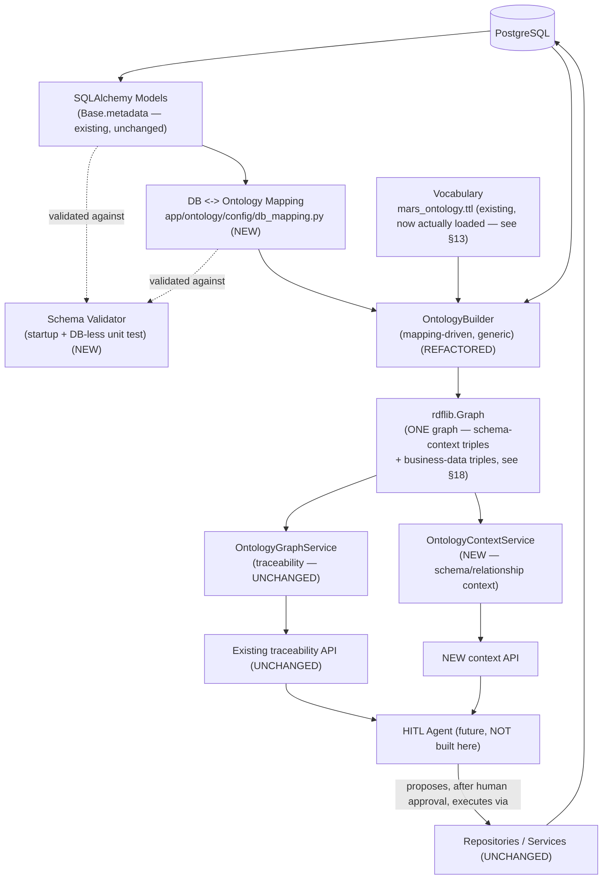
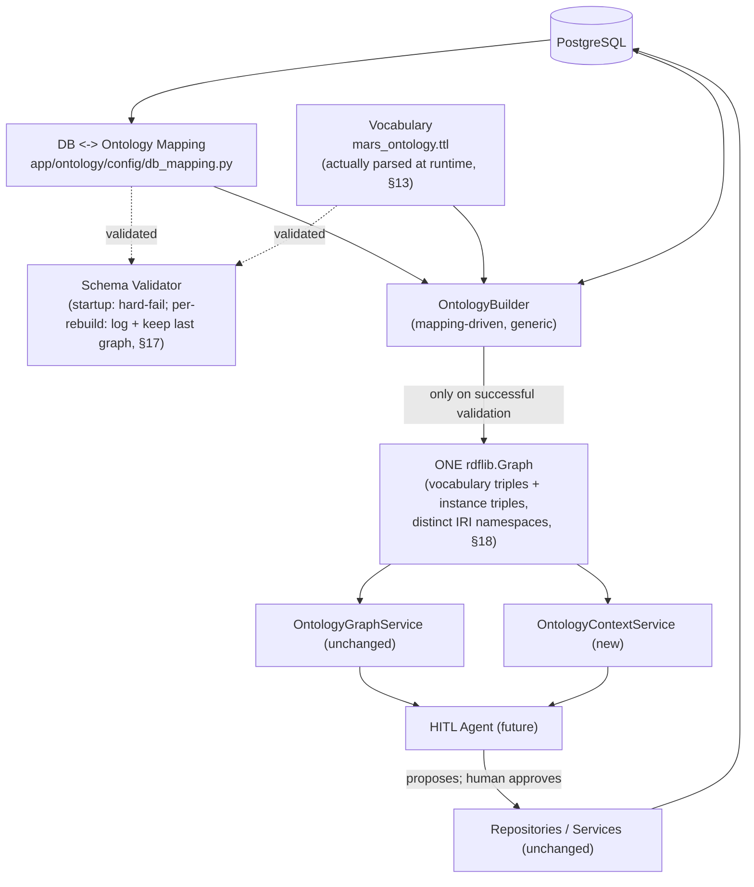

# Semantic Context Layer — Design for a Future HITL Agent

**Status:** Proposal — design only. No production code, TTL vocabulary, migrations, APIs, repositories, models, or tests are changed by this document.
**Companion document:** `docs/ontology/ontology-context-layer-design.md` (the first next-phase design pass — broader migration plan, mapping-config shape, context-API sketch). This document goes deeper on four specific areas that document treats at a higher level: RDF graph design (single graph vs. named graphs), a scored comparison table for the mapping strategy, an explicit validation-failure-behavior decision tied to the existing atomic graph swap, and a fully worked end-to-end HITL scenario. Where the two overlap, this document restates the position briefly and cites the companion doc rather than re-arguing it from scratch.

---

## 1. Executive Summary

Today's ontology (`app/services/ontology/`) is a read-only RDF traceability model: two SPARQL queries over a graph rebuilt from Postgres on an interval. The new ask is to evolve it into a **semantic context layer** — something a future HITL Agent can query to learn *what an entity is, what table backs it, what properties/relationships it has, and how to reach a related entity in business terms* — without the ontology ever executing a write itself. The motivating scenario: a user tells the future agent "update the replacement material for MAT-DISC-1001," and the agent needs to resolve "replacement" → `mars:succeededBy` → `common.material_master.follow_up_material_id` → the `Material` it should point at, *before* it ever proposes a concrete SQL/repository call for a human to approve.

**The core design decisions, stated up front:**
- **One RDF graph, not named graphs** (§18). Schema-context triples and business-data triples can share the existing `rdflib.Graph` safely, distinguished by IRI namespace, not by graph partitioning — named graphs (`rdflib.Dataset`) would add real SPARQL and code complexity this repo's scale doesn't justify.
- **Hybrid DB↔ontology mapping**: a Python mapping module (not YAML), validated against SQLAlchemy's own `Base.metadata` — full comparison in §11/§17, unchanged conclusion from the companion document, now with the specific scored table the user asked for.
- **Validation-failure behavior**: keep serving the last successfully-built graph on a rebuild failure; only a *first-ever* rebuild failure (no prior graph exists) should leave the API returning empty/degraded results rather than crash the app — both cases reuse the *existing* atomic-swap mechanism (`Container.refresh_ontology_graph`) with zero new locking logic.
- **CRUD stays exactly where it is** (`app/repositories/*`, `app/services/*`) — the semantic context layer answers "what/how related," never "do it."

This document is intentionally concrete: every example below cites a real file, class, column, or existing test in this repository — not a hypothetical schema.

---

## 2. Problem Statement

The current ontology can tell you *that* a CMIR record references a material and *that* a material master has a successor. It cannot tell a consumer *what MaterialMaster is*, *what table backs it*, *what its properties mean in business terms*, or *how to get from it to a related entity it hasn't been asked about yet* — because none of that is represented anywhere; it's implicit in `OntologyBuilder`'s Python code (`app/services/ontology/ontology_builder.py`) and the (currently unloaded-at-runtime — see §4) `mars_ontology.ttl` file's labels/comments.

Concretely, the current implementation cannot answer any of these without a human reading source code:
- "What database table does `Material` correspond to?"
- "What does `succeededBy` mean, and which physical column implements it?"
- "If I'm about to change a `MaterialMaster`'s successor, what other entities does that touch?"

## 3. Why We Need a Semantic Context Layer

Without one, a future agent (or a human) integrating with this data has exactly two options: read Python/SQL source code directly (works, but means the agent's "understanding" is actually hardcoded prompt engineering against a schema that can silently drift out from under it), or re-derive schema meaning from raw `information_schema` introspection (recovers physical structure, never business meaning — `follow_up_material_id` doesn't self-describe as "the material that replaces a discontinued row," and `cmir_record.material_identity` gives no hint that it's meant to be joined against `material.material_code` by value, since there's no FK forcing that join at all).

The semantic context layer exists to be the **one authored, reviewed place** that closes that gap — turning "read the code to understand the schema" into "query a stable, versioned interface that reflects the code."

---

## 4. Current Architecture

(Condensed from the companion document's §3, restated here for self-containedness; see that document for the full file-by-file trace.)

```
PostgreSQL (cmir.cmir_record, common.material/material_master/plant)
    │ bulk read — CmirRecordRepository.list_current(), MasterDataRepository.list_*_rows()
    ▼
materialize_job.rebuild(container)     [app/services/ontology/materialize_job.py]
    ▼
OntologyBuilder.build_rdf_triples(...) [app/services/ontology/ontology_builder.py — ALL mapping knowledge hardcoded here]
    ▼
rdflib.Graph (in-memory)  →  Container.refresh_ontology_graph()  [app/core/container.py]
    ▼
OntologyGraphService (SPARQL, read-only)  [app/services/ontology/graph_service.py]
    ▼
GET /api/v1/ontology/materials/{code}/traceability
GET /api/v1/ontology/material-masters/{id}/successor-chain   [app/api/v1/ontology.py]
```

Lifecycle: `app/main.py`'s `lifespan` starts one `asyncio` background task per process (`_run_ontology_materialize_loop`), immediate first rebuild, then every `ONTOLOGY_REFRESH_INTERVAL_SECONDS` (default 300s, `app/core/config/ontology.py`). Every cycle is a **full rebuild**, swapped in atomically under `Container._ontology_graph_lock` — this atomic-swap property is the exact mechanism §17's validation-failure design reuses.

**A gap worth restating plainly (also noted in the companion document's §3.5): `mars_ontology.ttl` is never parsed/loaded at runtime today.** `OntologyBuilder` builds the `MARS` namespace directly in Python (`MARS = Namespace("https://ontology.mars-cmir.nablon.ai/")`) and references properties as bare attribute access (`MARS.referencesMaterial`). The `.ttl` file and the Python code are two independently hand-synchronized descriptions of the same four relationships, with nothing checking they agree. This matters directly for §14 (schema validation) below.

## 5. Current Limitations

1. **No generic schema/entity description exists anywhere** — only four hardcoded relationships, each its own bespoke code block.
2. **No distinction between physical schema and business meaning is enforced** — it exists informally (the `.ttl` file's `rdfs:comment`s), but nothing keeps the Python builder and the Turtle file in sync (§4's gap).
3. **No validation** — a renamed/removed column would silently produce an incomplete graph (a missing `referencesMaterial` edge, say) with no error anywhere, discovered only by a human noticing wrong query results. This actually happened this session (the `target_grd_code`→`material_identity` fix required manually finding and updating three stale test fixtures — nothing caught it automatically).
4. **Not queryable for "what is this entity"** — only for the two specific pre-built traceability questions.
5. **Not designed for many entities** — four relationships as bespoke code blocks is fine; forty would not be.

---

## 6. Target Architecture



Everything marked UNCHANGED is exactly the shipped, tested system today. Everything marked NEW/REFACTORED is this design's scope.

---

## 7. Schema Context Model

What the context layer should represent per entity, and where each piece lives — the user's own list, answered item by item:

| Concept | Where it lives | Becomes an RDF triple? |
|---|---|---|
| Entity (e.g. `MaterialMaster`) | `mars_ontology.ttl` (`owl:Class`) + `db_mapping.py` (`EntityMapping.model`) | Yes — `mars:MaterialMaster a owl:Class` (already exists) |
| Physical table (`common.material_master`) | `db_mapping.py` only | **No** — physical table names are an implementation detail an agent doesn't need as a *triple*; the mapping config is the authoritative source, exposed via the context API's response (§20/§21), not embedded in the graph itself (see §19 for the full schema-vs-business-data reasoning) |
| Primary key (`id`) | `db_mapping.py` (`EntityMapping.iri_key_column` doubles as this, or a dedicated field) | No |
| Property (e.g. `discontinuationIndicator`) | `mars_ontology.ttl` (`owl:DatatypeProperty`) + `db_mapping.py` (`PropertyMapping.column`) | Yes — as instance data already (`mars:discontinuationIndicator` is already a real, materialized triple per instance today) |
| Physical column (`discontinuation_indicator`) | `db_mapping.py` only | No |
| Datatype | `mars_ontology.ttl` (`rdfs:range xsd:string`, etc.) | Only as the vocabulary's own declaration, not per-instance (rdflib's `Literal` already carries an implicit XSD type at the instance level) |
| Nullable/required | `db_mapping.py` (new field, e.g. `PropertyMapping.required: bool`, read off the real SQLAlchemy column's `nullable` attribute at validation time rather than hand-duplicated — see §14) | No |
| Foreign key / relationship | `mars_ontology.ttl` (`owl:ObjectProperty`, business meaning) + `db_mapping.py` (physical implementation, FK vs. value-join — see §10) | Yes — as instance data already (`mars:succeededBy` triples exist today) |
| Business meaning/description | `mars_ontology.ttl` (`rdfs:comment`) | Exposed via context API, not as a separate triple (an `rdfs:comment` **is** already an RDF triple in the standard OWL/RDFS sense once the file is actually loaded — see §13 — so this one is "yes" once that gap is closed) |

### Answering the user's six explicit questions

1. **Which of these should exist in the ontology vocabulary (`.ttl`)?** Only what's already there in spirit: classes, object/datatype properties, and their labels/comments. Not physical table/column names, not primary-key names, not nullability — those are implementation facts, not business vocabulary.
2. **Which should remain configuration/metadata only (`db_mapping.py`)?** Physical table, physical column, primary key, nullability, relationship *implementation kind* (FK vs. value-join) — everything in the "physical" column of the table above.
3. **Which should become RDF triples?** Class/property declarations (already true), business descriptions (once §13's gap is closed), and — unchanged from today — actual instance data (a real `CmirRecord`'s `brand`, a real `MaterialMaster`'s `succeededBy` edge).
4. **Which should NOT be represented in RDF?** Physical table/column names, primary key column names, SQLAlchemy-level nullability — putting these *in the graph* would mean the graph itself needs to be schema-change-aware (defeating the entire point of separating physical from semantic, §16), and would duplicate what `db_mapping.py` already says more precisely and more checkably (§14's `AttributeError`-at-import-time guarantee only exists because these are Python attribute references, not RDF literals).
5. **Should schema metadata and business-data triples live in the same graph?** **Yes** — see §18 for the full argument; short version: distinct IRI namespaces are enough separation at this scale, and named graphs cost more than they solve here.
6. **Named graphs, or single graph?** **Single graph** — same answer, §18.
7. **Simplest design that satisfies the requirement?** Don't put physical schema facts in RDF at all; keep them in the Python mapping config (already true of the current implementation's approach — `OntologyBuilder` never puts a raw column name in a triple today, it only ever emits the semantic property). This document's job is to make that same discipline hold as the vocabulary grows, not to invent a new mechanism.

---

## 8. Semantic Entity Model

An **entity** = one `owl:Class` in `mars_ontology.ttl` + one `EntityMapping` in `db_mapping.py` pointing at exactly one SQLAlchemy model/table. Today's four: `CmirRecord` → `app.models.cmir.cmir_record.CmirRecord` (`cmir.cmir_record`), `Material`/`MaterialMaster`/`Plant` → `app.models.common.material`/`.plant` (`common.material`/`.material_master`/`.plant`).

**Design rule**: one entity, one table. No entity should be assembled from a join of two tables — if a future need arose for a "composite" concept spanning two tables, that should be modeled as a *relationship* between two entities (as `MaterialMaster`↔`Material` already is), never as a single entity mapped to a SQL join, which would break the clean "one row → one individual" IRI derivation the builder already relies on (`OntologyBuilder.material_master_iri`, etc.).

---

## 9. Property / Attribute Model

A **property** = one `owl:DatatypeProperty` + one `PropertyMapping` (entity, column, datatype, required). Every property mapped today is a plain scalar column (`String`, nullable or not) — no current property is itself derived/computed. **Recommendation**: keep it that way for this phase — a computed/derived property (e.g. "days since discontinued," computed from `effective_out_date`) is a real future need but is *behavior*, not a mapping fact, and should be modeled as a method on `OntologyBuilder`/`OntologyContextService`, not as an entry that pretends to be a plain column mapping. Flagged as an **OPEN QUESTION** (§31) rather than designed further here, since nothing today needs it.

Not every real column needs a property mapping — per the companion document's §8, the vocabulary today deliberately omits `MaterialMaster.available_quantity`, `.uom`, `.effective_out_date`, `.source_system`, `.last_synced_at`: real columns, not currently business-relevant to any ontology consumer. Adding a mapping entry for a column should be a deliberate "this is now something the context layer should know about" decision, not automatic.

---

## 10. Relationship Model

Every relationship must be classified by **kind**, because the four that exist today are not all the same shape — this is the single most important technical fact this document (and its companion) can state, and getting it wrong would make the mapping config actively misleading:

| Relationship | Physical implementation | Kind | Why |
|---|---|---|---|
| `mars:succeededBy` (`MaterialMaster` → `Material`) | `common.material_master.follow_up_material_id` → `common.material.id` | **Real, declared FK** (`app/models/common/material.py`: `follow_up_material_id: Mapped[UUID \| None] = mapped_column(..., ForeignKey(f"{COMMON_SCHEMA}.material.id"), ...)`) | A genuine `ForeignKey` constraint exists at the ORM level. |
| `mars:locatedAtPlant` (`MaterialMaster` → `Plant`) | `common.material_master.plant_id` → `common.plant.id` | **Real, declared FK**, nullable | Same pattern. |
| `mars:hasPlantRecord` (`Material` → `MaterialMaster`) | Inverse of `common.material_master.material_id` → `common.material.id` | **Real FK, reverse direction** | `Material` has no column pointing at `MaterialMaster`; the relationship is asserted from the "one" side by inverting `material_master.material_id`'s FK. A mapping config must express "reverse of relationship X," not just "follow this FK," or this relationship becomes inexpressible. |
| `mars:referencesMaterial` (`CmirRecord` → `Material`) | `cmir.cmir_record.material_identity` = `common.material.material_code` | **NOT a foreign key — a semantic/value-match relationship** | `cmir_record.material_identity` is a plain `String(255)` column (`app/models/cmir/cmir_record.py`) with **no FK constraint anywhere in the schema**. The join is enforced only by application logic (`OntologyBuilder._add_cmir_record`'s `if cmir_record.material_identity in known_material_codes:` check) — nothing in Postgres itself prevents a `cmir_record` row whose `material_identity` matches no real material. This is exactly the relationship that changed columns this session (`target_grd_code` → `material_identity`) with zero schema-level signal that anything needed to change — a mapping/config-level fact, never derivable from FK introspection alone (§11, Option 3's core weakness). |

**Database relationship** (§ terminology, restated from the companion document's §9): a physical FK constraint, described by column names/types, that changes when a migration changes it. **Semantic relationship**: a named, directional, business-meaningful fact between two ontology classes (`mars:succeededBy`'s label/comment), that changes only when business meaning changes. The mapping config (§12) is the translation layer between the two — critically, for `referencesMaterial`, **there is no database relationship to translate from**, only a business convention the mapping config must assert on Postgres's behalf.

---

## 11. DB-to-Ontology Mapping Strategy

Four options evaluated (per the companion document's §11, reproduced here in the scored-table format specifically requested):

### 11.1 Comparison

| Dimension | Hardcoded Python (status quo) | YAML/JSON config | DB introspection (auto-derive from schema) | **Hybrid (recommended)** |
|---|---|---|---|---|
| Maintainability | Poor beyond ~5 relationships — every addition is a new bespoke code block | Good in isolation, but drifts silently from the real schema (see next rows) | Excellent — zero manual mapping to maintain | Good — one reviewed Python file, small and centralized |
| Schema-change impact | High — rename touches builder + tests by hand (proven this session) | High — string column names don't break until *runtime*, and only if something checks them | None for physical changes, but see "semantic flexibility" below | Low for renames (one mapping-entry edit); zero for the vocabulary itself |
| Semantic flexibility | Full (it's just Python) | Full, but needs a bespoke mini-language for non-trivial kinds (reverse-FK, value-join, §10) | **None** — cannot express business meaning at all (`follow_up_material_id` doesn't self-describe as "replacement"; `material_identity`'s join to `material_code` isn't a real FK, so introspection can't even *find* it) | Full — same as hardcoded Python, since the mapping *is* Python |
| Validation capability | None today | Needs a bespoke validator that re-parses table/column strings | Trivially "valid" by construction (it *is* the schema) — but tells you nothing about whether it's *correct* | Strong — `AttributeError` at import time for renamed columns (free), plus an explicit validator for deeper checks (§14) |
| Developer experience | Familiar (it's just code) but repetitive | Requires learning a schema-within-a-schema (the YAML's own structure) | None to learn, but also no way to declare "this is a business relationship" | Familiar — same skills as maintaining the ORM models themselves |
| Runtime complexity | None (already running) | Low (parse once at startup) | Low, but must run against a live DB connection every rebuild (a new dependency the current design doesn't have) | Low — same shape as today's builder, plus one validation pass |
| Risk of configuration drift | High (bespoke code, no systematic check) | High (string-based, nothing forces it to match reality until an explicit validator runs) | **None** (can't drift from a schema it reads live) | Low — Python references can't silently drift (they'd raise `AttributeError`); the explicit validator catches the rest |
| Suitability for HITL | Poor — nothing queryable exists | Fair — parseable, but semantically thin without heavy hand-authoring | **Poor** — an agent needs "replacement material," not "nullable UUID FK to material.id" | Good — the mapping directly encodes the business relationship kind (§10) an agent needs |
| Testing complexity | Ad hoc, per relationship | Needs a schema-for-the-schema validator, itself another thing to test | Low (it's just introspection, hard to get "wrong") but tests can't assert business meaning | Low — one generic test loops over the mapping (companion doc §14) |

### 11.2 Recommendation

**Hybrid.** Static, Python-authored semantic mapping (captures business meaning — the one thing pure DB introspection structurally cannot do, since `follow_up_material_id` and `material_identity` do not self-describe their business purpose) **plus** runtime/CI validation against the real schema (catches drift — the one thing hardcoded Python today has zero mechanism for). Full mechanics and mapping-file shape: companion document §10–§13; this document's job was the comparison table above and the FK-vs-value-join classification in §10, both requested specifically for this artifact.

**What comes from PostgreSQL**: the actual, current column existence/type/nullability (read via `Base.metadata` at validation time, never re-typed by hand). **What comes from configuration** (`db_mapping.py`): which column backs which semantic property/relationship, and the relationship's kind (FK / reverse-FK / value-join). **What comes from the vocabulary** (`mars_ontology.ttl`): class/property names and their business-meaning labels/comments. **What is generated**: nothing — this design deliberately avoids code generation (a fifth option not asked for, and not needed at this scale; generation would add a build step and a class of "generated file is stale" bugs the Python-reference approach already avoids for free). **What is manually maintained**: the mapping file and the vocabulary file, both small, both reviewed like any other code change.

---

## 12. Mapping Configuration Proposal

(Restated from the companion document §10.1/§12, with the FK/reverse-FK/value-join kinds from §10 above made explicit — this is the same proposal, not a second competing one.)

**Location**: `app/ontology/config/db_mapping.py`, sibling to the existing `app/ontology/schema/mars_ontology.ttl` — everything ontology-*definitional* lives under `app/ontology/`, everything ontology-*behavioral* stays under `app/services/ontology/` (unchanged split).

```python
# Illustrative — exact shape belongs to implementation-time review, not locked in here.

@dataclass(frozen=True)
class PropertyMapping:
    ontology_property: str            # must exist as an owl:DatatypeProperty in mars_ontology.ttl
    column: InstrumentedAttribute      # e.g. MaterialMaster.discontinuation_indicator — a REAL column
                                        # reference, not a string; see §11's "risk of drift" row

@dataclass(frozen=True)
class EntityMapping:
    ontology_class: str                # must exist as an owl:Class in mars_ontology.ttl
    model: type                        # e.g. MaterialMaster
    iri_key_column: InstrumentedAttribute
    properties: list[PropertyMapping]

class RelationshipKind(Enum):
    FOREIGN_KEY = "foreign_key"        # e.g. succeededBy, locatedAtPlant
    REVERSE_FOREIGN_KEY = "reverse_fk" # e.g. hasPlantRecord
    VALUE_MATCH = "value_match"        # e.g. referencesMaterial -- NOT a DB-level FK, see §10

@dataclass(frozen=True)
class RelationshipMapping:
    ontology_property: str             # must exist as an owl:ObjectProperty in mars_ontology.ttl
    kind: RelationshipKind
    from_entity: str
    from_column: InstrumentedAttribute # the FK column, or the value-match column
    to_entity: str
    to_column: InstrumentedAttribute | None = None  # required only for VALUE_MATCH
                                        # (FK kinds resolve to_entity's PK implicitly)

ENTITIES: list[EntityMapping] = [ ... ]

RELATIONSHIPS: list[RelationshipMapping] = [
    RelationshipMapping("succeededBy", RelationshipKind.FOREIGN_KEY,
                        "MaterialMaster", MaterialMaster.follow_up_material_id, "Material"),
    RelationshipMapping("hasPlantRecord", RelationshipKind.REVERSE_FOREIGN_KEY,
                        "Material", MaterialMaster.material_id, "MaterialMaster"),
    RelationshipMapping("referencesMaterial", RelationshipKind.VALUE_MATCH,
                        "CmirRecord", CmirRecord.material_identity, "Material", Material.material_code),
]
```

**Entity mapping**: one `EntityMapping` per ontology class, §8. **Property mapping**: one `PropertyMapping` per datatype property, §9. **Relationship mapping**: one `RelationshipMapping` per object property, tagged with its `RelationshipKind` (§10) — this tag is the one addition beyond the companion document's original sketch, made explicit here because this document's job was specifically to nail the FK-vs-value-match distinction. **FK mapping**: `RelationshipKind.FOREIGN_KEY`/`REVERSE_FOREIGN_KEY`, `to_column` inferred as the target's primary key. **Datatype mapping**: read off the real column's SQLAlchemy type at validation time (§14), not hand-declared in the mapping (avoids a second place datatypes can drift). **Optional/required**: read off the real column's `nullable`, same reasoning. **Business descriptions**: stay in the `.ttl` file's `rdfs:comment`, never duplicated into the mapping. **Natural/business keys**: `EntityMapping.iri_key_column` — already how `Material`/`Plant` derive stable IRIs from `material_code`/`plant_code` today; `MaterialMaster`/`CmirRecord` fall back to their primary key since they have no natural key (unchanged from today's `OntologyBuilder`). **Versioning**: not needed for this phase — the mapping file itself is versioned by git like any other source file; a formal schema-version field would only matter if the mapping were ever consumed by something outside this repository's own deploy, which it isn't.

---

## 13. Mapping vs. Ontology Vocabulary Separation

The rule, stated once, precisely: **the vocabulary (`mars_ontology.ttl`) never contains a physical table or column name; the mapping (`db_mapping.py`) never contains a business description.** A rename that doesn't change business meaning (§16, Case 8) touches only the mapping. A change in business meaning (§16, Case 9) may touch the vocabulary — and only then.

**Closing §4's gap, as part of this design (not a separate phase — it's required for the validator in §14 to be able to check "does this mapping's `ontology_property` actually exist in the vocabulary"):** `mars_ontology.ttl` should actually be **parsed** at validation time — `rdflib.Graph().parse("app/ontology/schema/mars_ontology.ttl", format="turtle")` — rather than only existing as a Python-side namespace convention. This doesn't change how `OntologyBuilder` emits *instance* triples (it can keep using `MARS.propertyName` attribute access, which is just a convenient way to construct the same URIRef rdflib would parse from the file) — it only means something, for the first time, actually checks the file and the code agree.

---

## 14. Schema Validation Design

Every check the user asked for, with the real column/relationship it would have caught this session:

| Check | Mechanism | Example from this repo |
|---|---|---|
| Mapped table exists | `Base.metadata.tables[...]` lookup (no live DB — `Base.metadata` is populated purely by importing the ORM models, already true of every existing unit test) | If `common.material_master` were renamed, this fails immediately. |
| Mapped column exists | Same `Base.metadata` lookup, or — for free — `AttributeError` at Python import time if the mapping references `MaterialMaster.follow_up_material_id` and that attribute no longer exists | **This exact check would have caught this session's `target_grd_code`→`material_identity` change automatically** if the mapping had existed and pointed at the old (now-removed-from-ontology-use) field. |
| Mapped PK exists | Same mechanism, applied to `EntityMapping.iri_key_column` | — |
| Mapped FK exists and points at the expected table | For `RelationshipKind.FOREIGN_KEY`/`REVERSE_FOREIGN_KEY`: inspect the column's actual `ForeignKey` constraint (`column.foreign_keys`) and confirm it targets the mapping's declared `to_entity`'s table | Confirms `MaterialMaster.follow_up_material_id` really targets `common.material.id`, not some other table a future migration might accidentally repoint it to. |
| Target semantic entity exists | Lookup within `ENTITIES` by name | Confirms `to_entity="Material"` in the `succeededBy` mapping actually has an `EntityMapping`. |
| Datatype mismatch | Compare `column.type` (SQLAlchemy) against the vocabulary's declared `rdfs:range` (once §13's `.ttl` parse exists) | Lower severity — warn, don't hard-fail (§17). |
| Invalid relationship mapping (e.g. a `VALUE_MATCH` missing its required `to_column`) | Structural check within the config loader itself, no DB needed | Would catch a mis-typed `referencesMaterial` entry missing `to_column=Material.material_code`. |
| Mapping references stale DB structure | Union of all the above | — |
| Required metadata missing | Structural check (every `RelationshipMapping` must resolve to a declared vocabulary property, per §13) | — |

**The `referencesMaterial` case, validated correctly (per the user's explicit instruction not to mis-classify it):** the validator must **not** try to check this as an FK (`column.foreign_keys` would correctly report *empty* for `CmirRecord.material_identity`, since there genuinely is none). Instead, for `RelationshipKind.VALUE_MATCH`, the validator confirms both `from_column` and `to_column` exist as real columns of their respective tables and are datatype-compatible for a string comparison (both `String`) — it validates the *mapping's structural claim*, not a database-level constraint that doesn't exist. Misclassifying this as an FK check would make the validator report a false failure on every startup, since Postgres has no such constraint to find.

---

## 15. Schema Evolution Strategy

Nine cases, each showing physical change → mapping → ontology → code → validation → deployment → HITL impact. **Case 8 is the one this session's own history demonstrates concretely.**

| # | Case | Mapping change? | Vocabulary (`.ttl`) change? | Code change? | Validation behavior | Deployment impact | HITL impact |
|---|---|---|---|---|---|---|---|
| 1 | Column rename, e.g. `follow_up_material_id` → `replacement_material_id` | **Yes** — one `RelationshipMapping.from_column` reference updated | **No** (meaning unchanged — this *is* Case 8, see below) | No (assuming §18's Phase 4 generic builder) | Old mapping fails at import (`AttributeError`) until updated | None beyond the mapping PR merging alongside the migration | None — `mars:succeededBy` is unchanged, agent's understanding is unaffected |
| 2 | Table rename, e.g. `common.material_master` → `common.material_plant_detail` | **Yes** — `EntityMapping.model`'s table reference | No | No | Fails at `Base.metadata` lookup until updated | None beyond mapping PR | None — class name `MaterialMaster` can stay, or be renamed too if desired (separate decision, not forced) |
| 3 | Column added, e.g. a new `common.material_master.lead_time_days` | **Optional** — only if the new column should become a mapped property (§9's "deliberate decision" principle) | Only if added — new `owl:DatatypeProperty` | No (if not mapped) / additive (if mapped) | No failure either way — an unmapped column is invisible to ontology, exactly as today's already-unmapped columns are | None if not mapped; additive if mapped | Agent gains a new fact to reason with, only if deliberately added |
| 4 | Column removed, e.g. `discontinuation_indicator` dropped | **Yes** — must remove the `PropertyMapping` *before* the migration ships, or validation fails at the next startup after the migration | Possibly — if the property becomes permanently meaningless, remove the `owl:DatatypeProperty` too (else leave it declared but never populated) | No | Fails loudly (§17) if mapping isn't updated first | **Sequencing matters**: mapping removal should land in the same deploy as (or before) the migration | Agent stops seeing a property it used to see — should be a deliberate, communicated change, not a silent one |
| 5 | FK changes target table | **Yes** — `RelationshipMapping.to_entity` updated | Only if business meaning changes (Case 9) | No | §14's "FK points to expected table" check fails until updated | Mapping PR alongside migration | If meaning is unchanged, agent's understanding of `succeededBy` is unaffected; only the physical resolution changes |
| 6 | New table/entity introduced | **Yes** — new `EntityMapping` (+ `RelationshipMapping`s to/from it) | **Yes** — new `owl:Class` (+ new `owl:ObjectProperty`s if it introduces relationships) | Possibly — if the builder needs a new bulk-read repository method (as `list_current()`/`list_material_rows()` etc. were added this session) | New entries validate like any other | Additive, no impact on existing entities | Agent gains an entirely new entity to query once added |
| 7 | Removed table/entity | **Yes** — remove `EntityMapping` + any `RelationshipMapping`s referencing it | **Yes** — remove the `owl:Class` (and any properties that only existed for it) | Possibly | Fails if a relationship still references the removed entity and isn't also removed | Coordinated removal (mapping + vocabulary + migration together) | Agent loses an entity — should be deliberate |
| 8 | **Physical field name changes, business meaning unchanged** (this session's actual case: `target_grd_code` → `material_identity` as the ontology-matching column) | **Yes, only the mapping** | **No** | **Under the target architecture: no** (this session, under the *current* hardcoded architecture, it required editing `OntologyBuilder`'s Python body directly, plus 3 test fixtures — this is precisely the pain point Cases 1/8 are designed to eliminate) | Old mapping fails at import until updated (same as Case 1) | Mapping PR only | None — the agent's semantic understanding of "references material" is unchanged throughout |
| 9 | **Business meaning itself changes** (e.g. `succeededBy` is redefined to mean "recommended substitute" rather than "official replacement," a genuine policy change, not a column swap) | Possibly, if the physical source also changes | **Yes** — the `owl:ObjectProperty`'s `rdfs:comment`/label must be reviewed and updated to reflect the new meaning | Possibly, if the query/traversal logic needs to change to match the new meaning | Structural validation (§14) is unaffected either way — it can't detect a *meaning* change, only a *structural* one; this must be caught by human review of the vocabulary diff, not a mechanical check | Requires vocabulary review, not just a migration review | **Directly changes what the agent tells a human** — highest-impact case, must never be treated as "just a mapping update" |

**The distinction the user asked to be explicit about, stated once more directly**: physical schema change (Cases 1–8) is something the mapping config absorbs, ideally with zero vocabulary or builder-code change. Semantic/business-meaning change (Case 9) is something only a human, reviewing the vocabulary file itself, can correctly make — no mechanism in this design (or any design) can safely auto-detect "the business meaning changed," because that's a fact about intent, not structure.

---

## 16. Physical Schema Change vs. Semantic Change

(Answered inline throughout §15's table; restated as its own short section since the user called it out as critical.) The test to apply when a schema change lands: **"did the sentence in `mars_ontology.ttl`'s `rdfs:comment` stop being true?"** If no — it's a physical change, fix the mapping only. If yes — it's a semantic change, the vocabulary itself needs review, and that review is a human judgment call this design deliberately does not try to automate.

---

## 17. Validation Failure Behavior

Options evaluated, against the existing atomic-swap mechanism (`Container.refresh_ontology_graph`, `app/core/container.py`):

| Option | Verdict | Why |
|---|---|---|
| A. Fail application startup on *any* validation failure | **Partially recommended** — only for the mapping-vs-`Base.metadata`/vocabulary structural checks (§14), run once at process startup, before the rebuild loop starts | These are static facts about code + schema that can't change between requests; failing fast here is the same posture `Container.build()` already takes today for a broken checkpointer connection. |
| B. Reject the rebuild but keep serving the last valid graph | **Recommended, for a *periodic* rebuild's failure** | This is not new work — `materialize_job.rebuild()`'s current structure already only calls `Container.refresh_ontology_graph()` *after* a full, successful build (`app/services/ontology/materialize_job.py`); a failure partway through (e.g. a transient DB error, or — post this design — a validation failure) simply means `refresh_ontology_graph()` is never called that cycle, and `Container._ontology_graph` keeps holding whatever it already had. **Zero new locking/swap logic needed** — this is exactly what the existing atomic-swap design already gives for free, it just needs the validation call added to the rebuild path so a *structural* mapping problem is treated the same way a DB connectivity problem already is (logged, retried next interval, per `app/main.py`'s existing `_run_ontology_materialize_loop`). |
| C. Build a partial graph (skip only the broken entity/relationship, publish everything else) | **Rejected** | Directly contradicts principle 15 ("invalid/partial ontology graphs should not be published") — a partial graph is worse than an unchanged stale one, because it looks complete to a caller with no signal anything is missing. |
| D. Disable ontology APIs entirely on validation failure | **Rejected as the default; acceptable as a manual operational lever, not automatic** | Too blunt for a transient/partial mapping problem when a perfectly good last-known-good graph already exists to keep serving; automating "take the API down" for what might be one bad relationship entry is a worse outcome for callers than serving slightly stale data. |
| E. Other | — | — |

**Recommended composite behavior**:
- **Startup** (no prior graph exists yet): run the full structural validation (§14) once. If it fails, **fail application startup loudly** (Option A) — there is no "last good graph" to fall back to, and starting the app with ontology silently broken from minute one is worse than refusing to start.
- **Every subsequent rebuild cycle**: validation + build happen before any swap. If either fails, log it (exactly as today's `except Exception: logger.exception(...)` in `_run_ontology_materialize_loop` already does), **do not call `refresh_ontology_graph()`**, and retry next interval (Option B) — the currently-served graph is untouched, callers see no difference except the data ages one more interval than usual.
- This requires **zero changes to the swap mechanism itself** — `Container.refresh_ontology_graph`'s lock-guarded, all-or-nothing replacement already has exactly the property this behavior needs; the only new code is (a) the validation call added at startup and (b) the validation call added inside `rebuild()`, both already inside try/except boundaries in the target design.

---

## 18. RDF Graph Design

**Recommendation: one `rdflib.Graph`, not RDF named graphs (`rdflib.Dataset`/`ConjunctiveGraph`).**

Schema-context "triples" this design actually needs (§7's table) are minimal: the class/property declarations and `rdfs:comment`s already living in `mars_ontology.ttl`. Once §13 closes the "never actually parsed" gap, those triples *do* end up in the same graph as instance data if the builder simply also loads the vocabulary file into the same `Graph` object it's populating with rows — and this is safe because:

1. **Namespace separation is sufficient at this scale.** Vocabulary triples use `MARS.ClassName`/`MARS.propertyName` as their *subject or predicate*; instance triples use IRIs like `.../material/{code}` as their *subject*. A SPARQL query for "give me MaterialMaster instances" (`?s a mars:MaterialMaster`) never accidentally matches the vocabulary's own `mars:MaterialMaster a owl:Class` declaration in a way that breaks anything — `rdf:type` already correctly distinguishes "this IRI is a class" from "this IRI is an instance of that class." This is standard RDFS/OWL practice (a schema and its instance data routinely coexist in one graph in every real-world Linked Data application) — nothing about this repo's use case is unusual enough to need graph-level partitioning.
2. **Named graphs solve a different problem than the one we have.** They exist for provenance/context-per-fact ("which source said this triple is true"), access control per subgraph, or multi-tenant graph isolation — none of which apply here. Adopting them would mean every SPARQL query in `OntologyGraphService` needs an explicit `GRAPH <...>` clause, `rdflib.Graph()` becomes `rdflib.Dataset()` throughout `materialize_job`/`Container`/tests, and every existing test (`tests/unit/services/test_ontology_graph_service.py`'s `(s, p, o) in graph` assertions) needs re-verifying against the new API shape — real, non-trivial cost, for a separation plain namespacing already provides.
3. **Rebuild semantics stay identical.** If vocabulary triples are (re-)loaded into the same fresh `Graph()` every rebuild cycle (a cheap, static parse of one small `.ttl` file, unchanged run to run), the existing full-rebuild-then-atomic-swap model (§4, §17) needs no new concept — "the graph" is still one thing, still swapped as a whole.

**Where schema-context triples and business-data triples differ, concretely**: schema triples are *static* (same every rebuild, sourced from the `.ttl` file) and small in count (dozens); business-data triples are *dynamic* (change every rebuild, sourced from Postgres) and the dominant volume (hundreds–thousands, per `docs/ontology.md`'s own live counts). Nothing about that difference requires them to live in separate graphs — it only means the builder's "load static vocabulary" step is a fixed, cheap, once-per-rebuild operation distinct from its "load dynamic rows" step, which is already exactly how `OntologyBuilder.build_rdf_triples` is structured today (separate, ordered method calls within one build pass).

---

## 19. Schema Metadata vs. Business Data

Restating §18's conclusion from the angle the user's outline specifically calls out as its own section: **schema metadata (what an entity/property/relationship *means*) and business data (actual instances) are different in *lifecycle* and *volume*, not in *storage location*.** Schema metadata changes when a human edits `mars_ontology.ttl` (rare, reviewed); business data changes every rebuild interval (frequent, mechanical). Keeping them in one graph, distinguished by IRI namespace and `rdf:type`, means one query language (SPARQL), one storage object (`Graph`), and one swap mechanism serves both — with the context API (§20) simply choosing to query the static/vocabulary subset (§7's "no live graph needed for `get_entity_context`" point from the companion document) versus the dynamic/instance subset (traceability, unchanged).

---

## 20. HITL Context Contract

(Method signatures per the companion document §15.1, unchanged; this section focuses on the response-shape detail and the FK/value-match distinction surfacing in the contract itself, which the companion document didn't spell out at this level of concreteness.)

```python
def get_entity_context(entity: str) -> EntityContext: ...
def get_relationships(entity: str) -> list[RelationshipContext]: ...
def traverse_relationship(entity: str, relationship: str, key: str) -> list[EntityInstanceRef]: ...
def get_operation_context(entity: str, operation: Literal["create", "read", "update", "delete"]) -> OperationContext: ...
```

### 20.1 `get_entity_context("MaterialMaster")` — example response

```json
{
  "entity": "MaterialMaster",
  "physical_table": "common.material_master",
  "primary_key": "id",
  "description": "Per-plant material/stock detail; one row per (material, plant).",
  "properties": [
    {"name": "sapMaterialNumber", "column": "sap_material_number", "datatype": "string", "required": true},
    {"name": "discontinuationIndicator", "column": "discontinuation_indicator", "datatype": "string", "required": false},
    {"name": "effectiveOutDate", "column": "effective_out_date", "datatype": "date", "required": false}
  ]
}
```

### 20.2 `get_relationships("MaterialMaster")` — example response, with relationship kind exposed

```json
{
  "entity": "MaterialMaster",
  "relationships": [
    {
      "name": "succeededBy",
      "target_entity": "Material",
      "kind": "foreign_key",
      "physical_implementation": "common.material_master.follow_up_material_id -> common.material.id",
      "description": "The Material that replaces a discontinued MaterialMaster row."
    },
    {
      "name": "locatedAtPlant",
      "target_entity": "Plant",
      "kind": "foreign_key",
      "physical_implementation": "common.material_master.plant_id -> common.plant.id",
      "description": null
    }
  ]
}
```

### 20.3 `get_relationships("CmirRecord")` — the value-match case, made explicit

```json
{
  "entity": "CmirRecord",
  "relationships": [
    {
      "name": "referencesMaterial",
      "target_entity": "Material",
      "kind": "value_match",
      "physical_implementation": "cmir.cmir_record.material_identity = common.material.material_code (no FK constraint)",
      "description": "Links a CMIR record to the internal Material its material_identity resolves to."
    }
  ]
}
```

Exposing `kind` and `physical_implementation` explicitly (rather than presenting every relationship as if it were an FK) is the concrete design response to the user's instruction not to mis-classify `referencesMaterial` — a future agent reasoning about "how confident should I be this relationship holds" needs to know a `value_match` relationship has no database-enforced guarantee behind it, unlike a `foreign_key` one.

**Whether `physical_table`/`physical_implementation` belong in the agent-facing response at all** is flagged in the companion document (§15.4) as a lean-toward-yes-for-debug-only question; this document takes the position that at minimum `kind` (FK vs. value-match) must be exposed, since it materially affects how much an agent should trust the relationship — the raw column name is more debatable and can reasonably be omitted from the primary response per that same section.

---

## 21. HITL Query Examples

Restating the user's own conceptual queries against the concrete contract above (illustrative, not implemented):

- *"What is MaterialMaster?"* → `get_entity_context("MaterialMaster")` → §20.1.
- *"Which database table represents MaterialMaster?"* → same response's `physical_table` field.
- *"What properties does MaterialMaster have?"* → same response's `properties` list.
- *"What relationships does MaterialMaster have?"* → `get_relationships("MaterialMaster")` → §20.2.
- *"What does succeededBy mean?"* → §20.2's `description` field for that relationship (sourced from `mars_ontology.ttl`'s `rdfs:comment`, §13).
- *"Which physical DB field implements succeededBy?"* → §20.2's `physical_implementation` field.
- *"What is the target entity of succeededBy?"* → §20.2's `target_entity` field.
- *"How is MaterialMaster related to Plant?"* → filter `get_relationships("MaterialMaster")` for `target_entity == "Plant"` → `locatedAtPlant`.
- *"What context is required before updating succeededBy?"* → `get_operation_context("MaterialMaster", "update")` — flagged as an **OPEN QUESTION** in the companion document (§21, item 2) since no canonical "which service owns this write" registry exists yet; this document doesn't re-solve that, only restates it applies here too.
- *"What entities may be affected if MaterialMaster is updated?"* → `get_relationships("MaterialMaster")` already answers "what it points to" (`Material`, `Plant`); "what points *at* it" (i.e. does anything reference a `MaterialMaster` the way `CmirRecord` references a `Material`?) is not modeled by any current relationship, and answering it in general means the context service also needs to search `RELATIONSHIPS` for entries whose `to_entity == "MaterialMaster"` — mechanically simple, but not built in this design, only noted as something `get_relationships` should logically support answering both directions.

---

## 22. HITL CRUD Boundary

| Layer | Answers | Never does |
|---|---|---|
| **Ontology / Semantic Context** | *What* does this entity/relationship mean? What table/column implements it? What's the target entity? | Execute a write; decide business policy; check who is allowed to do something |
| **HITL Agent** (future) | *What* operation is the user asking for? What context is required? What should be proposed? When is human approval required? | Bypass the repository/service layer to write directly; treat ontology context as authorization |
| **Service Layer** | What business rules must be applied to a proposed operation? | Answer schema/relationship questions — that's ontology's job, not the service layer's |
| **Repository** | How is the database accessed? | Know anything about "business meaning" — it operates on ORM models exactly as today |
| **PostgreSQL** | Where the actual data lives | — |

**Why ontology must not execute CRUD**: it holds no transaction, no session, no write path — it is a derived, disposable, rebuild-at-any-time snapshot (unchanged principle from today's implementation, §2/§5 of the companion document). Giving it write execution would mean either duplicating the entire repository layer's transactional/validation logic inside the ontology service (a second, drift-prone copy of business rules), or having it silently delegate to the repository layer anyway — at which point it's not "ontology executing CRUD," it's just a confusing extra hop, with no benefit.

**Should the context layer expose CRUD-capability metadata / read-only-vs-writeable / required fields / affected relationships?** Per the companion document's §8/§15.1: **not yet**. `required` fields *are* already exposed (§20.1's `required: true/false`, sourced from real column nullability) since that's structurally free and directly useful. "Which service handles writes for this entity" is not modeled anywhere in the codebase today and would need a new registry this design doesn't propose building until the agent's actual needs are known (Phase 6, companion document §18). **This must never become an authorization system** — even if a future "writeable: true" flag were added, it would describe *mechanical capability* (a repository method exists), never *permission* (whether *this* user/agent/request is allowed to invoke it) — that check belongs entirely to whatever the future HITL Agent's own approval flow enforces (per the existing HITL pattern already documented in `docs/ARCHITECTURE.md` for CMIR/PO-validation), never to ontology.

---

## 23. End-to-End HITL Example

Scenario: *"Update the replacement material for MAT-DISC-1001 to MAT-REPL-1001."* **Entirely illustrative — no part of this is implemented; every component below marked "future" does not exist yet.**

| # | Step | What happens |
|---|---|---|
| 1 | User request | A human tells the (future) HITL Agent the sentence above, in a chat-style or ticket-style interface (not specified/built here). |
| 2 | HITL interpretation | The agent recognizes "replacement material" as a domain concept it should resolve via the semantic context layer, not guess at directly, and recognizes `MAT-DISC-1001`/`MAT-REPL-1001` as material codes. |
| 3 | Semantic context query — entity | Agent calls `get_entity_context("Material")` and/or `get_entity_context("MaterialMaster")` to confirm which entity actually owns "replacement" (it's `MaterialMaster.succeededBy`, not something on `Material` itself). |
| 4 | Entity identification | Agent resolves `MAT-DISC-1001` to a specific `MaterialMaster` row — this step needs an instance lookup (e.g. via the *existing* traceability graph/API, since `OntologyGraphService`/`Container.get_ontology_graph()` already holds instance data, or via a repository call — which one is appropriate is itself an **OPEN QUESTION**, §31). |
| 5 | Relationship identification | Agent calls `get_relationships("MaterialMaster")`, finds `succeededBy`, reads its `description` ("the Material that replaces a discontinued MaterialMaster row") — confirms this is the concept "replacement" maps to. |
| 6 | Physical DB mapping resolution | Agent reads `succeededBy`'s `physical_implementation` (§20.2): `common.material_master.follow_up_material_id -> common.material.id`, and its `kind: foreign_key` — so it knows this is a real, constrained relationship, not a soft value-match one (contrast with step-5-equivalent reasoning for `referencesMaterial`, which would need different handling). |
| 7 | Validation/context checks | Agent confirms `MAT-REPL-1001` resolves to a real, existing `Material` row (the target of the FK) — a **read**, via existing repository/graph lookups, never a write. |
| 8 | Proposed operation | Agent composes a proposal: "Set `MaterialMaster(MAT-DISC-1001).follow_up_material_id` to the `Material` id for `MAT-REPL-1001`" — expressed in terms a human reviewer can understand (ideally: "mark MAT-REPL-1001 as the replacement for MAT-DISC-1001"), not raw SQL. |
| 9 | Human approval | A human reviews the proposal (per the existing HITL pattern in `docs/ARCHITECTURE.md` — an interrupt/resume-shaped flow, or equivalent) and approves or rejects. |
| 10 | Service layer | On approval, the **existing** `MasterDataRepository`/a service wrapping it (not ontology) receives the write request — e.g. an `update_material_master_follow_up(...)`-shaped call that does not exist today and would be new service-layer work, out of scope for this design. |
| 11 | Repository | The repository issues the actual `UPDATE common.material_master SET follow_up_material_id = ... WHERE ...` (or the ORM-equivalent), inside a transaction, exactly as every other write in this codebase already works. |
| 12 | PostgreSQL update | The row is durably updated — this is the moment "source of truth" changes; ontology has not been touched yet. |
| 13 | Post-write ontology refresh | The **existing** background rebuild loop (`app/main.py`'s `_run_ontology_materialize_loop`) picks up the change on its next scheduled interval — **no new "trigger a rebuild on write" mechanism is proposed here**; this is the same staleness window already documented in `docs/ontology.md`'s own known gaps ("no admin/manual trigger-a-rebuild-now endpoint"). If that staleness window is unacceptable for this specific HITL flow, an on-demand rebuild trigger becomes a real requirement — flagged as an **OPEN QUESTION** (§31), not solved here. |
| 14 | Verification/read-back | Once refreshed, `GET /api/v1/ontology/material-masters/{MAT-DISC-1001's id}/successor-chain` (the **existing**, unchanged API) now reflects the new successor — the human (or the agent, on their behalf) can confirm the change took effect using a capability that already exists today. |

---

## 24. Existing API Compatibility

Nothing in this design changes `GET /api/v1/ontology/materials/{material_code}/traceability` or `GET /api/v1/ontology/material-masters/{material_master_id}/successor-chain` — their request/response shapes, their `Envelope[T]` wrapping, their dependency wiring (`get_ontology_graph_service`), and their backing `OntologyGraphService` methods are all unchanged. The new context API (§20) is purely additive, under the same router conventions (`app/api/v1/ontology.py` or a sibling file — a file-organization call deferred to implementation time, per the companion document §18 Phase 5).

---

## 25. Refresh / Synchronization Model

Unchanged from today (§4): full rebuild on an interval, atomic swap. This design's one addition is the validation step inside that same rebuild path (§17) — no change to *when* rebuilds happen, only to *what happens if one produces an invalid result*. §23 step 13 already covers the specific "how fresh is post-write data" question and explicitly does not propose an on-demand trigger as part of this design.

---

## 26. Testing Strategy

Per the companion document's §14 in full; restated briefly here since this document's own scope (validation-failure behavior, single-graph design) adds two specific new test concerns:

- **New**: a test proving a rebuild-cycle validation failure leaves `Container.get_ontology_graph()` returning the *previous* graph unchanged (§17's Option B) — constructing a valid graph, then a mapping deliberately made invalid, running `rebuild()`, and asserting the graph object identity is unchanged and the API still serves the old data.
- **New**: a test proving vocabulary and instance triples coexisting in one graph don't cross-contaminate a SPARQL query (§18) — e.g. a query for `?s a mars:MaterialMaster` returns only real instance IRIs, never `mars:MaterialMaster` itself (which is only ever the *object* of an `rdf:type` triple about the class declaration, never a subject matching that pattern) — a cheap, mechanical proof the single-graph design is safe in practice, not just in theory.
- Everything else — mapping validation, entity/relationship generation, graph queries, context APIs, schema-change regression, HITL contract — per the companion document's §14 table, unchanged.

---

## 27. Migration Plan

This document does not propose a second, competing migration plan — the companion document's §18 (6 phases: extract mapping → validator → optional vocabulary extension → generic builder refactor → context API → HITL contract) already covers it, and nothing in this document's additional analysis (named-graph decision, validation-failure behavior, the worked scenario) changes that phase sequence. Two additions worth folding into those phases when implementation starts:
- **Phase 2** (validator) should include the §17 rebuild-path integration (log-and-retry-without-swapping on a mid-rebuild validation failure), not only the startup check the companion document emphasized.
- **Phase 1 or 4** (whichever actually touches `OntologyBuilder`'s vocabulary loading) should include §13's "actually parse `mars_ontology.ttl` at runtime" fix — this is a small, contained change (adding one `graph.parse(...)` call plus the file being read into the same graph the builder populates) that both closes a real existing gap and is a prerequisite for §14's "does this mapping's property exist in the vocabulary" check to be meaningful.

---

## 28. Risks and Trade-offs

| Risk | Mitigation |
|---|---|
| Parsing `mars_ontology.ttl` at runtime for the first time (§13) could surface a latent mismatch between the file and the Python code that's been silently wrong until now. | Treat this as a *feature*, not a regression risk — finding and fixing such a mismatch (if one exists) is exactly the validation gap this whole design closes; budget time for it in whichever phase implements §13/§27. |
| Single-graph design (§18) could, in principle, become harder to reason about as the vocabulary grows well beyond today's 4 classes/4 relationships. | Not a near-term risk (same reasoning as the companion document's §19) — revisit named graphs only if a concrete future need (e.g. genuine multi-tenant isolation, or per-source provenance tracking) actually arises, not preemptively. |
| Validation-failure behavior (§17) adds a new startup failure mode. | Already flagged in the companion document (§19) with the same staged-rollout mitigation (warn-only before hard-fail); restated as applying here too. |
| The worked HITL scenario (§23) surfaces at least one real open gap (on-demand rebuild trigger, §23 step 13) that this design doesn't solve. | Correctly scoped as an open question (§31), not silently glossed over — the scenario's value is precisely that it surfaced this gap concretely rather than leaving it implicit. |

---

## 29. What NOT to Build

Unchanged from the companion document's §20 — restated for this document's self-containedness: no OWL DL reasoner, no autonomous CRUD execution, no second database/schema for ontology metadata, no duplication of DB data beyond the existing derived graph, no dedicated microservice, no external graph database, no full generic schema-dump tool, no CRUD-capability/authorization metadata in this phase. **This document adds one explicit item**: no RDF named graphs / `rdflib.Dataset` (§18) — evaluated and rejected on its own merits here, not simply carried over from the companion document (which didn't address it explicitly).

---

## 30. Recommended End State



---

## 31. Open Questions / Decisions Needed

1. **Derived/computed properties** (§9) — out of scope for this phase; confirm nothing currently needs one before deferring further.
2. **`get_operation_context`'s CRUD-capability registry** (§20, §22) — same open question as the companion document's §21 item 2, restated because §23's worked scenario shows it's the exact thing step 10 needs and doesn't yet have.
3. **Instance lookup for a HITL Agent's "resolve this code to a row" step** (§23 step 4) — via the existing traceability graph, or a direct repository call? Not decided here; depends on whether the agent runs in-process (companion document §16's same open question).
4. **On-demand rebuild trigger** (§23 step 13, `docs/ontology.md`'s existing known gap) — does the HITL write-then-verify flow actually need fresher-than-interval data, or is the existing periodic cadence acceptable? Concretely surfaced by this document's worked scenario; not answered by it.
5. **`physical_table`/`physical_implementation` in the agent-facing response** (§20) — full exposure (this document's examples) vs. debug-only (companion document §15.4's lean) — needs a decision before Phase 5 implementation.
6. **Whether `mars_ontology.ttl` should be reformatted/extended when it's first actually parsed** (§13, §27) — likely no structural changes needed, but should be confirmed once the parse step is actually implemented and run against the real file for the first time.
